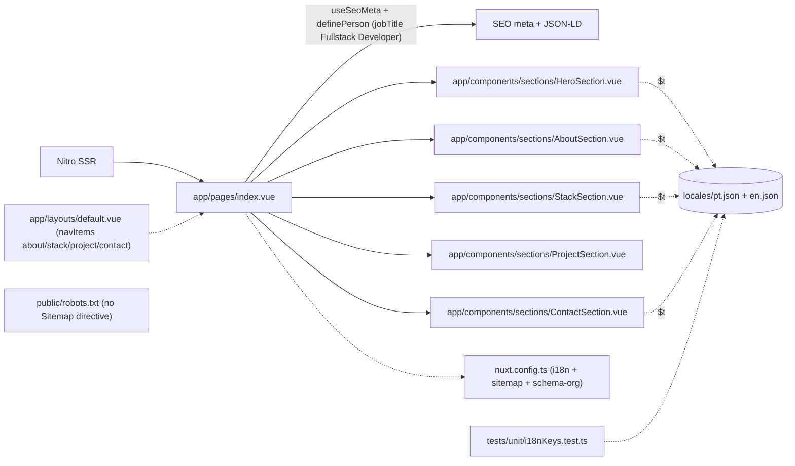
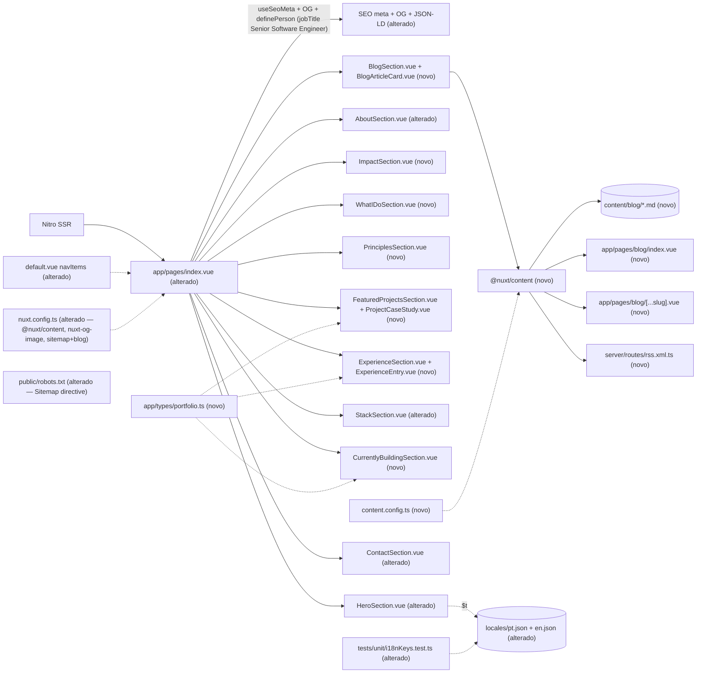

# Implementation Plan

## Request Summary
- Objective: Reposition the Nuxt 4 SSR personal site from "Fullstack Developer" to "Senior Software Engineer" for international recruiters through an iterative redesign — grow the information architecture from 5 to 11 sections, add a Nuxt Content blog with RSS, and complete the SEO surface — preserving the existing visual identity, component structure and i18n copy pipeline (evolution, not reconstruction).
- Scope:
  - In: repositioning copy/meta/JSON-LD; 11 sections in confirmed order; multi-project case studies from a single `status`-partitioned catalog; Nuxt Content blog (index + detail routes) + `/rss.xml` Nitro feed; complete SEO (meta, OG via `nuxt-og-image`, Schema.org, sitemap incl. blog, robots.txt, RSS discovery); locale schema extension (pt + en parity); typed data shapes for case studies, experience, impact and article frontmatter.
  - Out: real per-project prose and article bodies (deferred TBD copy — M-02/M-03/M-04); any backend/API/DB/auth/contact-form delivery (form stays client-only); a third locale, CMS admin or comments; visual redesign of components that already communicate seniority.
- Tier: complete
- Architecture references: `AGENTS.md`, `docs/agents/architecture.md`, `docs/agents/domain_rules.md` (all read; layering, i18n pipeline, locale-parity and component-placement rules honored below).

### Architecture rules honored (source of truth over description)
- **Layering** (`docs/agents/architecture.md` — Layer responsibilities): `app/pages/index.vue` owns route entry, section composition order, SEO meta and Schema.org; `app/components/sections/*` own presentation + client interactivity only; `locales/*.json` own all UI copy/data; `nuxt.config.ts` owns module wiring. New sections MUST NOT own routing, content strings or global config.
- **i18n pipeline** (`AGENTS.md` §2/§3, `docs/agents/domain_rules.md`): every UI string via `$t` from `locales/{pt,en}.json`; zero hardcoded text; brand proper-nouns in Tech Stack are the only allowed literals (RF-03 exception).
- **Locale parity** (`docs/agents/domain_rules.md`; `tests/unit/i18nKeys.test.ts`): `pt.json`/`en.json` share top-level keys and equal-length arrays before any `$t` reference.
- **Component placement** (`AGENTS.md` §2): page sections in `app/components/sections/`.
- **Format/lint** (`.prettierrc`): no semicolons, single quotes, printWidth 100; `eslint .` + `prettier --check .` must pass.
- **Verified current state**: `app/pages/index.vue` composes exactly 5 sections and holds `jobTitle: 'Fullstack Developer'` (line 51) and "Fullstack Developer" meta (lines 24-32); `app/layouts/default.vue` `navItems` = about/stack/project/contact (lines 290-295); `ContactSection.vue` email is `mailto:werlesson@email.com` (line 254); Hero primary CTA is Download Resume and secondary anchors `#project` (lines 147-197); `StackSection.vue` has 4 hardcoded groups (frontend/backend/database/infra); `hero.statTargets` = 8/24/2100 and `about.stats` = 8+/24+ (must become 6+/20+); `@nuxt/content` and `nuxt-og-image` are absent from `package.json`; `public/robots.txt` has no `Sitemap:` directive.

## AS IS — Componentes impactados

Legenda (PT-BR): estado atual verificado. `index.vue` compõe 5 seções e orquestra SEO/Schema.org com `jobTitle: Fullstack Developer`; toda a cópia vem de `locales/*.json` via `$t`; a nav do layout expõe só about/stack/project/contact; não existem `@nuxt/content`, blog, RSS nem diretiva `Sitemap:` no `robots.txt`.

## TO BE — Componentes propostos

Legenda (PT-BR): nós `NEW_*`/novos realizam — `content.config.ts` → RF-31/RF-35 (T02); `app/types/portfolio.ts` → RF-23/RF-25 (T03); locais + parity → RF-04/RF-46 (T04/T05); `HeroSection` alterado → RF-06..RF-11/RF-14 (T06); `AboutSection` → RF-12/RF-13 (T07); `StackSection` → RF-27/RF-28 (T08); `ContactSection` → RF-37/RF-38/RF-39 (T09); `default.vue` nav → RF-05 (T10); `ImpactSection` → RF-14/RF-15 (T11); `WhatIDoSection` → RF-16/RF-17 (T12); `PrinciplesSection` → RF-18 (T13); `FeaturedProjectsSection`+`ProjectCaseStudy` → RF-19..RF-24 (T14); `ExperienceSection`+`ExperienceEntry` → RF-25/RF-26 (T15); `CurrentlyBuildingSection` → RF-29/RF-30 (T16); `BlogSection`+`BlogArticleCard` → RF-01 teaser/RF-32 (T17); `content/blog/*.md` → RF-36 (T18); `blog/index.vue` → RF-32/RNF-03 (T19); `blog/[...slug].vue` → RF-33/RF-42 (T20); `server/routes/rss.xml.ts` → RF-34 (T21); `index.vue` composição+SEO → RF-01/RF-40/RF-41/RF-42/RF-45 (T22); `nuxt.config.ts` → RF-41/RF-43 (T23); `robots.txt` → RF-44 (T24).

## Data & content decisions
- **Structured short data → locale arrays** (consistent with the existing `about.timeline`/`about.stats` pattern): Impact metrics, What-I-Do cards, Engineering Principles, the single Featured/Currently-Building project catalog, and Experience entries all live as arrays under new namespaces in `locales/{pt,en}.json`, read via `tm()` (mirrors `HeroSection.vue` `tm('hero.statTargets')`). Rationale: parity is enforceable via `i18nKeys.test.ts`, no new content pipeline for short structured records, and empty-safe rendering is trivial.
- **Long-form prose → Nuxt Content**: only blog article bodies use `@nuxt/content`; single-locale-per-article via `locale` frontmatter, exempt from `i18nKeys.test.ts` (RF-04/RF-31/RF-35).
- **Typed shapes** (`app/types/portfolio.ts`, RF-23/RF-25): `CaseStudy` (id, title, `status: 'shipped' | 'building'`, image, liveUrl, repoUrl?, tags[], and eight narrative blocks image/description/problem/solution/architecture/techStack/challenges/results), `ExperienceEntry` (company, role, period, responsibilities, technologies, businessImpact), `ImpactMetric`, `Capability`, `Principle`. Components consume typed getters over the locale arrays; empty/partial entries render without throwing.
- **Single project catalog** (RF-19/RF-23/RF-29): one array keyed by `id` with a `status` enum. Featured Projects renders `status: shipped` (Camaris, Match Zone, ShapeLog, CSV View, Chalet SaaS); Currently Building renders `status: building` (Shrimp Farm Management SaaS, Future Products). De-dup by id guarantees mutual exclusion.
- **Canonical origin** `https://werlesson.dev` (M-01) for every OG/canonical/sitemap/robots/RSS absolute URL. **Recruiter email** `werlessono@gmail.com` (M-01/RF-11/RF-38) replaces the current `werlesson@email.com`. **Canonical metrics** 6+ years / 20+ projects (M-05) across `hero.statTargets`, `about.stats` and Impact.

## Tasks

### T01 — Add `@nuxt/content` + `nuxt-og-image` deps and wire modules
- **Files**: `package.json`, `nuxt.config.ts`
- **Change**: Add `@nuxt/content` and `nuxt-og-image` to dependencies; register both in `nuxt.config.ts` `modules` (alongside existing `@nuxtjs/i18n`, `@nuxtjs/sitemap`, `nuxt-schema-org`, `@vueuse/nuxt`, `@nuxt/eslint`). Add minimal `content` and `ogImage` config blocks. Do NOT alter `ssr: true`, `site.url`, fonts or i18n config. Run `yarn install`.
- **Covers**: RF-31, RF-41 (module foundation)
- **Tests**: `nuxt prepare` + `nuxt typecheck` succeed with new modules; no new test.
- **Risk**: Medium — new modules can affect build/SSR (RNF-07) and bundle; pin compatible versions for Nuxt ^4.4.4.
- **Dependencies**: none

### T02 — Define the blog content collection schema
- **Files**: `content.config.ts` (repo root, new)
- **Change**: Define a `blog` collection (`@nuxt/content` `defineCollection`) with a typed frontmatter schema: `title`, `description`/`summary`, `date` (publication), `slug`, `tags[]`, `locale` (required, single-valued), `draft` (boolean). Ensure missing required fields (incl. `locale`) fail validation / exclude the article.
- **Covers**: RF-35, RF-31
- **Tests**: covered by T27 schema-validation test.
- **Risk**: Medium — schema drives index/sitemap/RSS filtering; wrong `locale` handling breaks RF-32/RF-43.
- **Dependencies**: T01

### T03 — Portfolio TypeScript data shapes
- **Files**: `app/types/portfolio.ts` (new)
- **Change**: Export typed interfaces: `CaseStudy` (with `status: 'shipped' | 'building'` and the eight narrative blocks + optional `repoUrl`), `ExperienceEntry` (six fields incl. distinct `businessImpact`), `ImpactMetric`, `Capability`, `Principle`. These document the locale-array shapes consumed by sections; every field maps to an RF (RF-20/RF-23/RF-25/RF-26).
- **Covers**: RF-23, RF-25
- **Tests**: consumed by T26 partition/empty-safe tests.
- **Risk**: Low — pure types.
- **Dependencies**: none

### T04 — Extend locale catalogs with all new namespaces + repositioning copy
- **Files**: `locales/pt.json`, `locales/en.json`
- **Change**: Add, with strict pt/en parity and equal-length arrays: nav labels for the new section set (`nav.impact/whatIDo/principles/projects/experience/building/blog`); Hero — replace `role1/role2/role3` with a `hero.capabilities` array (SaaS, Product Engineering, Frontend Architecture, Laravel, Performance, System Design), add static `hero.title` = "Senior Software Engineer" (PT equivalent), `hero.subtitle` = "Building scalable SaaS products with Vue, Nuxt and Laravel.", `hero.description` = "I design, build and launch digital products — from architecture to production.", `hero.ctaProjects`/`ctaProjectsAria`, LinkedIn/GitHub/Email labels+aria; set `hero.statTargets` = {years:6, projects:20, commits:…}; About — reframe `about.bio`/`about.badge` to seniority/business-outcome language with no clichés, set `about.stats` to 6+/20+; add `impact`, `whatIDo` (6 cards title+description), `principles` (array), `featuredProjects` (+ project catalog array with `status`), `experience` (entries array), `currentlyBuilding`, `blog` namespaces; add `stack.groups.tools` and set Database/Infrastructure labels; set `contact.cta` = "Interested in working together?" and `contact.social.email.handle`/`href` copy to `werlessono@gmail.com`. No positioning copy may read "Frontend Developer" or "Full Stack Developer" (UI-07).
- **Covers**: RF-03, RF-04, RF-05, RF-06, RF-07, RF-08, RF-11, RF-12, RF-13, RF-14, RF-15, RF-16, RF-17, RF-18, RF-19, RF-23, RF-25, RF-26, RF-27, RF-29, RF-37, RF-38, RF-46, RF-47, UI-07
- **Tests**: `tests/unit/i18nKeys.test.ts` (updated in T05) passes.
- **Risk**: High — single shared file pair touched by the whole feature; any structural divergence fails parity and blocks every `$t`. Author both files in one pass.
- **Dependencies**: none

### T05 — Update locale-parity test for the new key set
- **Files**: `tests/unit/i18nKeys.test.ts`
- **Change**: Remove the `hero.role1/2/3` assertions (keys no longer exist per RF-06); add assertions for `hero.capabilities` (non-empty array, equal length pt/en), `hero.statTargets` positive, the new namespaces (`impact`, `whatIDo`, `principles`, `featuredProjects` catalog, `experience`, `currentlyBuilding`, `blog`) present and equal-length in both locales, and `stack.groups.tools`. Assert nothing about `content/` article bodies (RF-04 scope).
- **Covers**: RF-04, RF-46, RNF-05
- **Tests**: this IS the test; `vitest run` passes.
- **Risk**: Low.
- **Dependencies**: T04

### T06 — Reposition HeroSection
- **Files**: `app/components/sections/HeroSection.vue`
- **Change**: Render a **static** `hero.title` "Senior Software Engineer" as primary positioning; repoint the existing typewriter state machine to iterate `hero.capabilities` (replace the `roles` computed's `role1/2/3` reads with the array via `tm('hero.capabilities')`), preserving the tick logic and `typewriter.test.ts`. Add static `hero.subtitle` and keep `hero.description`. Swap CTAs: primary "View Projects" → smooth-scroll anchor `#projects` (Featured Projects id), secondary "Download Resume" → `/CV_Werlesson_Vieira.pdf`. Add accessible LinkedIn/GitHub/Email links (email `mailto:werlessono@gmail.com`) with localized aria-labels. Counters read `statTargets` (now 6/20). No new colors/fonts (RF-02).
- **Covers**: RF-06, RF-07, RF-08, RF-09, RF-10, RF-11, RF-14 (hero counters), RF-47, UI-07, UI-05
- **Tests**: existing `tests/unit/typewriter.test.ts` still passes (self-contained logic); hero title assertion added in T25.
- **Risk**: Medium — typewriter regression if the roles source is mis-wired; keep the state machine untouched, change only the data source.
- **Dependencies**: T04

### T07 — Reframe AboutSection (reuse, no replace)
- **Files**: `app/components/sections/AboutSection.vue`
- **Change**: Keep `AboutSection.vue` + `AboutTimelineStep.vue` and the timeline. Ensure the stats renderer reads the updated `about.stats` (6+/20+) and reframed bio from locale (authored in T04); no cliché phrasing. No structural component rewrite — verify reuse and that the `id="about"` anchor persists.
- **Covers**: RF-12, RF-13
- **Tests**: parity via T05; cliché-absence checked in T28 review.
- **Risk**: Low — copy lives in locale; component mostly unchanged.
- **Dependencies**: T04

### T08 — Extend StackSection to five categories (additive)
- **Files**: `app/components/sections/StackSection.vue`
- **Change**: Add a fifth `stack.groups.tools` group to the `stackGroups` array (e.g. ESLint, Prettier, Vitest, Git as brand proper-nouns — RF-03 exception), relabel the `database` group to "Database" and `infra` to "Infrastructure" via locale keys; adjust the grid to accommodate five groups responsively. Reuse `StackTechGroup.vue` + `StackTechCard.vue` unchanged (RF-28).
- **Covers**: RF-27, RF-28, RF-02, UI-01
- **Tests**: `stack.groups.tools` parity asserted in T05.
- **Risk**: Low — additive.
- **Dependencies**: T04

### T09 — Enhance ContactSection actions
- **Files**: `app/components/sections/ContactSection.vue`
- **Change**: Add the `contact.cta` "Interested in working together?" heading from locale; add a "Download Resume" action → `/CV_Werlesson_Vieira.pdf` to the existing social list (LinkedIn/GitHub/Email/Resume); change the email `href` from `mailto:werlesson@email.com` to `mailto:werlessono@gmail.com`. Preserve the client-only form (`onSubmit`, no network) exactly (RF-39).
- **Covers**: RF-37, RF-38, RF-39, RF-47
- **Tests**: mailto/href verified in T28 review.
- **Risk**: Low.
- **Dependencies**: T04

### T10 — Extend header/footer navigation
- **Files**: `app/layouts/default.vue`
- **Change**: Replace the four-item `navItems` with the new section set (about, impact, whatIDo, principles, projects, experience, stack, building, blog, contact — hashes matching each section `id`), labels from `$t` locale keys. The "Blog" nav item anchors to the on-page Blog teaser `id` (not `/blog`). Keep skip link, focus rings, mobile menu, `updateActiveHash` behavior. Footer unchanged (Keep).
- **Covers**: RF-05, UI-04, UI-05
- **Tests**: nav-anchor resolution asserted in T25.
- **Risk**: Medium — every nav hash must resolve to a real section `id` rendered by index.vue (coordination with T22); a mismatch breaks RF-05 AC.
- **Dependencies**: T04

### T11 — ImpactSection (new)
- **Files**: `app/components/sections/ImpactSection.vue` (new)
- **Change**: Render one item per `impact` metric entry (locale/`tm`-driven), showing 6+ years / 20+ projects and capability statements as a minimal block. Reuse the `useIntersectionObserver` (threshold 0.1) reveal pattern; no progress bars/percentages/charts (UI-06). `id="impact"`.
- **Covers**: RF-14, RF-15, UI-03, UI-06
- **Tests**: metric-count render checked in T25 ordering/anchor test.
- **Risk**: Low.
- **Dependencies**: T04

### T12 — WhatIDoSection (new)
- **Files**: `app/components/sections/WhatIDoSection.vue` (new)
- **Change**: Render six capability cards (SaaS Development, Frontend Architecture, Laravel APIs, Performance & SEO, System Design, Technical Leadership), title + short description per card from the `whatIDo` locale array. Scroll-reveal; no oversized icons/overdesigned cards (UI-06). `id="whatIDo"`.
- **Covers**: RF-16, RF-17, UI-03, UI-06
- **Tests**: parity via T05.
- **Risk**: Low.
- **Dependencies**: T04

### T13 — PrinciplesSection (new)
- **Files**: `app/components/sections/PrinciplesSection.vue` (new)
- **Change**: Render a minimal list from the `principles` locale array (Architecture First, Performance Matters, Developer Experience, SEO by Default, Scalable Systems, Clean Code, Business-Driven Decisions). Count/labels match the config; no oversized icons. `id="principles"`.
- **Covers**: RF-18, UI-03, UI-06
- **Tests**: parity via T05.
- **Risk**: Low.
- **Dependencies**: T04

### T14 — FeaturedProjectsSection + ProjectCaseStudy (new)
- **Files**: `app/components/sections/FeaturedProjectsSection.vue` (new), `app/components/sections/ProjectCaseStudy.vue` (new)
- **Change**: Read the single project catalog (locale array, typed via `app/types/portfolio.ts`), filter to `status: 'shipped'`, and render each as a full case study with the eight blocks (Image, Description, Problem, Solution, Architecture, Tech Stack, Challenges, Results) — omitting empty blocks gracefully (RF-24 empty-safe). Each renders a "View Project" button (live URL); "Source Code" button only when `repoUrl` exists (RF-22). Below-the-fold images `loading="lazy"` (RNF-02). `id="projects"`.
- **Covers**: RF-19, RF-20, RF-21, RF-22, RF-23, RF-24, RNF-02, RNF-04, UI-06
- **Tests**: shipped-filter + empty-safe + no-dup-id asserted in T26.
- **Risk**: Medium — schema/partition errors could duplicate ids across sections or crash on placeholder prose.
- **Dependencies**: T04, T03

### T15 — ExperienceSection + ExperienceEntry (new)
- **Files**: `app/components/sections/ExperienceSection.vue` (new), `app/components/sections/ExperienceEntry.vue` (new)
- **Change**: Render a professional timeline; each entry shows Company, Role, Period, responsibilities, Technologies and a distinct Business impact field from the `experience` locale array (typed). Empty-safe with placeholder/partial entries (RF-25). `id="experience"`.
- **Covers**: RF-25, RF-26, UI-03
- **Tests**: empty-safe asserted in T26; parity via T05.
- **Risk**: Low-Medium — must not throw on partial entries.
- **Dependencies**: T04, T03

### T16 — CurrentlyBuildingSection (new)
- **Files**: `app/components/sections/CurrentlyBuildingSection.vue` (new)
- **Change**: Read the same project catalog, filter to `status: 'building'` (Shrimp Farm Management SaaS, Future Products), present as active/in-progress (distinct from shipped case studies). No id may also appear in Featured Projects (guaranteed by the status partition). `id="building"`.
- **Covers**: RF-29, RF-30
- **Tests**: mutual-exclusion asserted in T26.
- **Risk**: Low.
- **Dependencies**: T04, T03

### T17 — BlogSection teaser + BlogArticleCard (new)
- **Files**: `app/components/sections/BlogSection.vue` (new), `app/components/sections/BlogArticleCard.vue` (new)
- **Change**: On-page teaser querying `@nuxt/content` for the latest 3–4 published articles in the active locale (descending date), rendering summaries only (title/date/summary) — NOT full bodies (RNF-03) — with a link to `/blog`. `id="blog"`. Empty-safe when no articles.
- **Covers**: RF-01 (teaser), RF-32 (teaser subset), RNF-03
- **Tests**: T25 asserts teaser cap ≤ 4 and `/blog` link.
- **Risk**: Medium — must not ship article bodies into the landing bundle; query with a fields projection.
- **Dependencies**: T04, T02, T01

### T18 — Placeholder blog articles
- **Files**: `content/blog/*.md` (new, ≥1 sample per authored locale)
- **Change**: Author at least one placeholder article with complete frontmatter (title, summary, date, slug, tags, `locale`, `draft: false`) and TBD body, so the engine renders without real content (RF-36/M-03).
- **Covers**: RF-36
- **Tests**: rendered by T19/T20; frontmatter validated in T27.
- **Risk**: Low.
- **Dependencies**: T02

### T19 — Blog index route `/blog`
- **Files**: `app/pages/blog/index.vue` (new)
- **Change**: Query the `blog` collection filtered to the active locale, `draft: false`, ordered by descending date; list title/date/summary. Code-split from the landing bundle (RNF-03). Localized via `prefix_except_default`. Reuse `BlogArticleCard.vue`.
- **Covers**: RF-32, RNF-03, RNF-07
- **Tests**: manual + T27 where feasible.
- **Risk**: Medium — locale filtering must match single-locale-per-article model.
- **Dependencies**: T01, T02, T18, T17

### T20 — Blog article route `/blog/[...slug]`
- **Files**: `app/pages/blog/[...slug].vue` (new)
- **Change**: Resolve each published article to `/blog/[slug]`, render its Markdown body (SSR, RNF-07). Emit per-article BlogPosting JSON-LD (`useSchemaOrg`) and a per-article `nuxt-og-image` OG image; canonical/OG absolute URLs on `https://werlesson.dev`. Code-split. Below-the-fold media lazy (RNF-02).
- **Covers**: RF-33, RF-42 (BlogPosting), RF-41 (per-article OG), RNF-02, RNF-03, RNF-07
- **Tests**: manual render + T27 for handler-adjacent logic.
- **Risk**: Medium — OG image generation per route can affect build time.
- **Dependencies**: T01, T02, T18

### T21 — RSS Nitro route handler `/rss.xml`
- **Files**: `server/routes/rss.xml.ts` (new)
- **Change**: Nitro route handler querying `@nuxt/content` for published articles, returning valid RSS XML (channel + items with title, absolute link on `https://werlesson.dev`, pubDate) at the stable `/rss.xml` route; set `content-type: application/rss+xml`.
- **Covers**: RF-34
- **Tests**: T27 unit-tests the XML shape/serialization.
- **Risk**: Medium — server-side content query API differs from client; validate against `@nuxt/content` server utils.
- **Dependencies**: T01, T02, T18

### T22 — Compose 11 sections + repositioned SEO in index.vue
- **Files**: `app/pages/index.vue`
- **Change**: Import and render the eleven sections in the confirmed order: Hero, About, Impact, What I Do, Engineering Principles, Featured Projects, Experience, Tech Stack, Currently Building, Blog, Contact. Update `useSeoMeta` title/description to the "Senior Software Engineer" positioning (replace lines 24-32 strings, locale-aware); add Open Graph (og:title/description/type/image) + `twitter:card=summary_large_image` with a `nuxt-og-image`-generated landing `og:image` (absolute origin); set `definePerson.jobTitle` to "Senior Software Engineer" and refresh `knowsAbout`; add an RSS auto-discovery `<link rel="alternate" type="application/rss+xml" href="/rss.xml">` in the head. Keep the `personSiteUrl` normalization.
- **Covers**: RF-01, RF-40, RF-41, RF-42, RF-45, RNF-07, UI-07
- **Tests**: section-order + head-link assertions in T25.
- **Risk**: Medium — composition order is the central RF-01 AC; every section `id` must match `navItems` hashes (T10).
- **Dependencies**: T06, T07, T08, T11, T12, T13, T14, T15, T16, T17
### T23 — Sitemap + OG-image config
- **Files**: `nuxt.config.ts`
- **Change**: Configure `@nuxtjs/sitemap` to include the home route, `/blog`, and every published article route as absolute `https://werlesson.dev` URLs, emitting only the existing locale URL per single-locale article (RF-43). Configure `nuxt-og-image` defaults (landing + BlogPosting templates). No change to `ssr`, i18n or fonts.
- **Covers**: RF-41 (config), RF-43
- **Tests**: manual sitemap inspection.
- **Risk**: Medium — dynamic content routes must be discoverable by the sitemap module (source from `@nuxt/content`).
- **Dependencies**: T01, T02, T18

### T24 — robots.txt sitemap directive
- **Files**: `public/robots.txt`
- **Change**: Add `Sitemap: https://werlesson.dev/sitemap.xml` while keeping crawl allowed (`User-Agent: * / Disallow:`).
- **Covers**: RF-44
- **Tests**: string presence checked in T28.
- **Risk**: Low.
- **Dependencies**: none

### T25 — Section-order, anchor and hero assertions test
- **Files**: `tests/unit/sectionComposition.test.ts` (new)
- **Change**: Assert the eleven section component order matches RF-01; every `navItems` hash resolves to a rendered section `id`; the Blog teaser caps at ≤4 items and links to `/blog`; hero title equals "Senior Software Engineer" (EN) and PT parity present. Prefer testing the exported order/config data structures over full DOM to stay in `environment: node`.
- **Covers**: RF-01, RF-05, RF-06 (title)
- **Tests**: this IS the test.
- **Risk**: Low-Medium — needs a testable exported ordering source; add one if composition is inline-only.
- **Dependencies**: T22, T10, T17

### T26 — Catalog partition & empty-safe tests
- **Files**: `tests/unit/projectCatalog.test.ts` (new)
- **Change**: Assert the shipped/building `status` partition is mutually exclusive by id (RF-19/RF-29), the case-study renderer is empty-safe with placeholder prose (RF-24), Experience entries carry six fields incl. distinct `businessImpact` and are empty-safe (RF-25/RF-26). Test the pure filter/getter logic over the locale catalog.
- **Covers**: RF-19, RF-24, RF-25, RF-26, RF-29, RF-30
- **Tests**: this IS the test.
- **Risk**: Low.
- **Dependencies**: T14, T15, T16, T03

### T27 — Blog schema + RSS handler tests
- **Files**: `tests/unit/blogFeed.test.ts` (new)
- **Change**: Assert the RSS serialization produces valid channel/item XML with absolute `https://werlesson.dev` links and pubDate (RF-34), and that an article missing a required frontmatter field (incl. `locale`) is excluded/invalid (RF-35). Extract pure serialization/validation helpers from T21/T02 for testability.
- **Covers**: RF-34, RF-35
- **Tests**: this IS the test.
- **Risk**: Low-Medium — may require refactoring the handler to export a pure builder.
- **Dependencies**: T21, T02, T18

### T28 — Full validation gate
- **Files**: none (validation only)
- **Change**: Run `eslint .`, `prettier --check .`, `nuxt typecheck`, `vitest run`; manually verify no cliché About copy (RF-13), no UI-06 anti-patterns and no "Frontend/Full Stack Developer" wording (UI-07) in new sections, dark-mode-by-default with no flash (UI-02), responsive at 360/768/1280 (UI-01), reduced-motion honored (UI-03), WCAG AA contrast (RNF-06), and a Lighthouse run > 95 on Performance/Accessibility/Best-Practices/SEO for the landing page (RNF-01). Confirm robots.txt/sitemap/RSS discovery resolve.
- **Covers**: RF-03 (eslint), RF-13, RF-44, UI-01, UI-02, UI-03, UI-06, UI-07, RNF-01, RNF-06
- **Tests**: the full command suite above.
- **Risk**: Medium — Lighthouse > 95 across four categories with new sections/OG images may need image-optimization tuning (RNF-04).
- **Dependencies**: T01-T27

## Execution Phases
| Phase | Tasks | Parallel-safe? |
|-------|-------|----------------|
| 1 — Foundation: deps, content schema, types | T01, T02, T03 | Partial (T02 after T01; T03 independent) |
| 2 — Locale catalog & parity | T04, T05 | No (T05 asserts T04) |
| 3 — Reposition existing sections + nav | T06, T07, T08, T09, T10 | Yes (distinct files) |
| 4 — New static sections | T11, T12, T13, T14, T15, T16, T17 | Yes (distinct files) |
| 5 — Blog engine & RSS | T18, T19, T20, T21 | Partial (T18 first; T19/T20/T21 distinct files) |
| 6 — Composition & SEO surface | T22, T23, T24 | Partial (distinct files; T22 after Phase 3+4) |
| 7 — Tests & validation | T25, T26, T27, T28 | Partial (T25/26/27 distinct files; T28 last) |

## Risks
| Risk | Blast radius | Mitigation | Rollback |
|------|-------------|------------|----------|
| Locale parity divergence in the large T04 edit | Every `$t` in the site fails / `i18nKeys.test.ts` red; blocks all sections | Author pt.json+en.json in one pass with identical structure; run T05 immediately after | Revert `locales/*.json` to prior commit; keys are additive |
| `@nuxt/content` / `nuxt-og-image` break SSR or build (RNF-07/RNF-01) | Whole site fails to render / Lighthouse regression | Pin Nuxt ^4.4.4-compatible versions; verify `nuxt build` + `nuxt typecheck` at end of Phase 1 | Remove modules from `nuxt.config.ts` + `package.json`; blog is additive |
| Typewriter regression when repointing to `hero.capabilities` | Hero cycling breaks; `typewriter.test.ts` risk | Change only the data source, keep the state machine + tick timings; test is self-contained | Revert HeroSection.vue |
| nav hash ↔ section `id` mismatch (T10 vs T22) | RF-05 AC fails; dead anchors | Single source of truth for hashes/ids; T25 asserts resolution | Revert navItems |
| Project catalog id collision across shipped/building | RF-19/RF-29 AC fail; duplicate rendering | De-dup by id in a shared getter; T26 asserts mutual exclusion | Correct `status` in locale catalog |
| Per-article OG image generation inflates build time | Slow CI/deploy | Cache OG images; limit templates to landing + BlogPosting | Disable `nuxt-og-image` runtime generation |
| Lighthouse < 95 from unoptimized case-study/blog images (RNF-01/RNF-04) | AC7 miss | Lazy-load below-the-fold, serve responsive/modern formats | Defer heavy media; placeholders are lightweight |

## Contracts emitted
Not applicable. This is a single-repo Nuxt 4 SSR site with no formal API/gRPC/AsyncAPI surface in the SPEC RIGID set; the `/rss.xml` Nitro handler is an internal route, not a formal contract. Contract emission skipped by design (SPEC "Distribution by Repo").

## Open Questions
- None blocking. Architecture references were provided and read (`AGENTS.md`, `docs/agents/architecture.md`, `docs/agents/domain_rules.md`); the plan honors their layering/i18n/parity rules. The one intentional deviation from the current codebase — replacing `hero.role1/2/3` and updating `i18nKeys.test.ts` / `domain_rules.md`'s documented parity key list — is driven by RF-06 and is captured in T04/T05 rather than planned silently.
- Non-blocking deferred copy (M-02 case studies, M-03 article bodies, M-04 experience entries) is TBD by confirmed decision "structure now, copy later"; all consuming sections are planned empty-safe (RF-24/RF-25/RF-36) so rendering never blocks.

## Assumptions
- Structured short data (impact, capabilities, principles, project catalog, experience) lives in `locales/*.json` arrays rather than Nuxt Content, per the FLEXIBLE guidance and consistency with `about.timeline` — [UNVERIFIED as the sole option] but parity-testable and empty-safe.
- The Hero retains its third "commits" counter (`hero.statTargets.commits`) alongside the canonical 6+/20+ metrics; only years/projects values change (M-05). [UNVERIFIED — SPEC mandates 6+/20+ but does not forbid the commits counter.]
- Tech Stack "Tools" group items (ESLint, Prettier, Vitest, Git) are treated as hardcoded brand proper-nouns under the RF-03 exception.
- `nuxt-og-image` and `@nuxt/content` have releases compatible with Nuxt ^4.4.4; version pinning is resolved during T01 install.
- `@nuxtjs/robots` is NOT adopted; `public/robots.txt` stays a static file edited in T24 (RF-44), minimizing new dependencies (FLEXIBLE allowed either).
