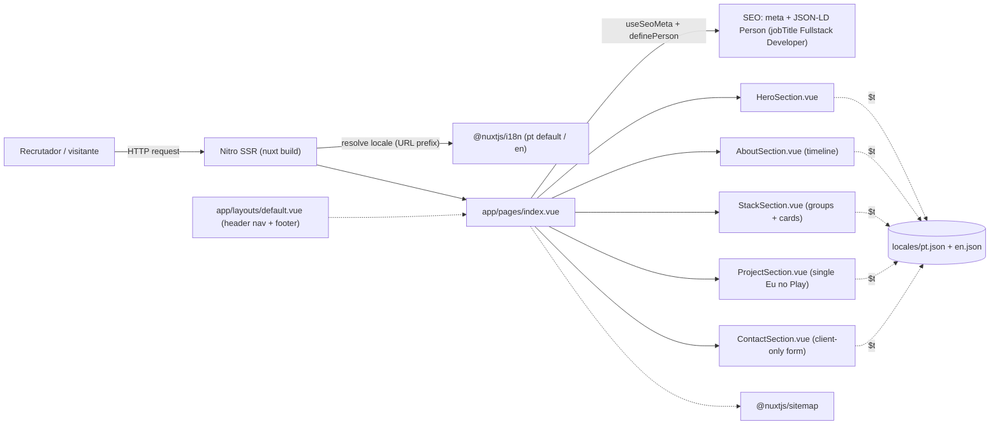
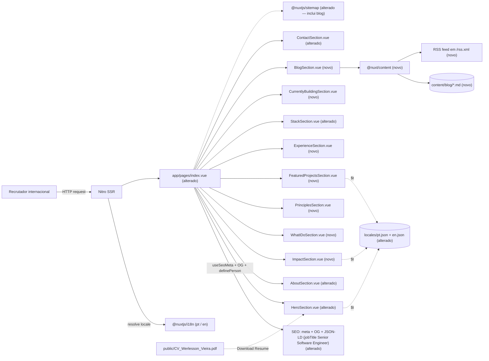

# SPEC: brand-repositioning-redesign

## Metadata
- Source: developer description via /plan (`.spec/base/PROMPT.md`) + confirmed input (`.spec/features/brand-repositioning-redesign/.handoff/confirmed-input.md`)
- Service: `werlesson-cv` (single-repo, Nuxt 4 SSR personal site)
- Tier: complete
- Version: 1.1
- Architecture references: `AGENTS.md`, `docs/agents/architecture.md`, `docs/agents/domain_rules.md`
- Concrete architecture rules honored:
  - **Layering** (`docs/agents/architecture.md` — Layer responsibilities): `app/pages/index.vue` owns route entry, section composition order, SEO meta and Schema.org; `app/components/sections/*` own presentation + client interactivity only; `locales/*.json` own all copy/data; `nuxt.config.ts` owns module wiring. Sections MUST NOT own routing, content strings or global config.
  - **i18n pipeline** (`AGENTS.md` §2, `docs/agents/domain_rules.md`): all UI copy in `locales/en.json` + `locales/pt.json`; `@nuxtjs/i18n` with `defaultLocale: 'pt'`, `strategy: 'prefix_except_default'` (`nuxt.config.ts:46-54`); zero hardcoded text (`AGENTS.md` §3 "Never add hardcoded UI text").
  - **Locale parity** (`docs/agents/domain_rules.md` — Locale parity rule; `tests/unit/i18nKeys.test.ts`): `pt.json` and `en.json` MUST share the same top-level key set and equal-length arrays before any `$t` reference.
  - **Component placement** (`AGENTS.md` §2): page sections live in `app/components/sections/`.
  - **Format/lint** (`AGENTS.md` §2, `.prettierrc`): no semicolons, single quotes, printWidth 100; `eslint .` and `prettier --check .` must pass.

## Context

The live personal site is a Nuxt 4 SSR single-page app (`app/pages/index.vue`) that composes five self-contained section components — `HeroSection`, `AboutSection`, `StackSection`, `ProjectSection` (single "Eu no Play" IoT demo), `ContactSection` — plus a shared header/footer in `app/layouts/default.vue` (verified `app/pages/index.vue:3-7`). All copy, timeline entries, stat targets and tags are data-driven from `locales/{pt,en}.json` (verified). SEO is emitted from `index.vue` via `useSeoMeta` + a single `definePerson` JSON-LD node whose `jobTitle` is currently `'Fullstack Developer'` (verified `app/pages/index.vue:51`). Sitemap ships via `@nuxtjs/sitemap`, structured data via `nuxt-schema-org`, and a static `public/robots.txt` exists (verified).

The current site positions the owner as a **Fullstack Developer** (site title, meta description and `definePerson.jobTitle` all say so — verified `app/pages/index.vue:24-32,51`). The confirmed goal is to **reposition him as a Senior Software Engineer** for international recruiters through an **iterative redesign, not a reconstruction**: preserve the existing visual identity, component structure and i18n copy pipeline, and add/rewrite only the sections that fail to communicate seniority. The target information architecture grows from 5 to **11 sections** (Hero, About, Impact, What I Do, Engineering Principles, Featured Projects, Experience, Tech Stack, Currently Building, Blog, Contact) plus a **Nuxt Content-powered blog with an RSS feed** and a **complete SEO surface**.

`@nuxt/content` is **not yet a dependency** and there is **no `content/` directory** (verified — absent from `package.json`); the blog engine is net-new. No RSS/feed dependency is present (verified). This SPEC defines structure, component boundaries and locale/content schema now; real per-project case-study prose and article bodies are deferred as `[NEEDS CLARIFICATION]` / TBD per the confirmed decision "structure now, copy later" — they do NOT block planning.

## AS IS — Estado atual

Legenda (PT-BR): estado atual verificado — `app/pages/index.vue` compõe apenas 5 seções e orquestra SEO/Schema.org, com toda a cópia vinda de `locales/*.json` via `$t`. O `jobTitle` do JSON-LD e o título/descrição de SEO ainda dizem "Fullstack Developer", e a navegação do layout expõe só `about/stack/project/contact`.

### AS-IS audit — Strengths (preservar)
- Clean data-driven pipeline: copy, timeline, stat targets and tags all in `locales/*.json`; components render from them (`docs/agents/data_model.md`, verified). Low-risk to extend.
- Solid, non-flashy interaction layer already aligned with the premium/minimal brief: typewriter role cycling, animated counters, scroll-triggered one-way reveal via `useIntersectionObserver` (threshold 0.1) (verified `docs/agents/domain_rules.md`).
- Accessibility scaffolding already present in the layout: skip link, focus-visible rings, keyboard-driven mobile nav, aria labels (verified `app/layouts/default.vue`).
- Dark-mode-by-default aesthetic with design tokens (`accent`, `background`, `textPrimary`, fonts Syne/DM Sans) in `tailwind.config.ts` (verified).
- SEO foundation exists: `useSeoMeta`, `definePerson` JSON-LD, `@nuxtjs/sitemap`, static `robots.txt` (verified).

### AS-IS audit — Weaknesses (corrigir)
- Positioning is **Fullstack Developer**, not Senior Software Engineer — contradicts the confirmed target (site title/description `index.vue:24-32`, `definePerson.jobTitle` `index.vue:51`).
- Only 5 of the 11 target sections exist; no Impact, What I Do, Engineering Principles, Featured Projects (case studies), Experience, Currently Building or Blog.
- "Featured work" is a single IoT demo (`ProjectSection` "Eu no Play"), not a set of product case studies.
- No blog engine, no RSS, no Open Graph image, no Article/BlogPosting Schema.org.
- `robots.txt` is permissive but does not reference a sitemap; no explicit OG/canonical URL alignment.

### Per-section Keep / Improve / Replace / Remove

| # | Target section | Current component | Decision | Justification |
|---|----------------|-------------------|----------|---------------|
| 1 | Hero | `HeroSection.vue` | Improve | Reuse structure/animations; rewrite copy to the confirmed title/subtitle/description/CTAs and add explicit LinkedIn/GitHub/Email links (RF-06..RF-11). |
| 2 | About | `AboutSection.vue` + `AboutTimelineStep.vue` | Improve | Keep component + timeline; reframe bio to seniority/business-outcome language, drop clichés (RF-12, RF-13). |
| 3 | Impact | — | Replace (new) | New content-driven metrics section (RF-14, RF-15). |
| 4 | What I Do | — | Replace (new) | New 6-card capability section (RF-16, RF-17). |
| 5 | Engineering Principles | — | Replace (new) | New minimal principles section (RF-18). |
| 6 | Featured Projects | `ProjectSection.vue` | Replace | The single "Eu no Play" demo is repurposed into a case study or the Currently Building set; the section becomes a multi-project case-study renderer (RF-19..RF-24). |
| 7 | Experience | — | Replace (new) | New professional timeline with business impact (RF-25, RF-26). |
| 8 | Tech Stack | `StackSection.vue` + `StackTechGroup.vue` + `StackTechCard.vue` | Improve | Reuse the group/card components; extend categories to Frontend/Backend/Infrastructure/Database/Tools (RF-27, RF-28). |
| 9 | Currently Building | — | Replace (new) | New section signalling continuous shipping (RF-29, RF-30). |
| 10 | Blog | — | Replace (new) | New Nuxt Content engine + RSS (RF-31..RF-36). |
| 11 | Contact | `ContactSection.vue` | Improve | Keep client-only form + social links; add "Interested in working together?" CTA and Download Resume button (RF-37..RF-39). |
| — | Header nav | `app/layouts/default.vue` `navItems` | Improve | Extend/relabel nav to reflect the new section set (RF-05). |
| — | Footer | `app/layouts/default.vue` | Keep | Already on-brand; no change required. |

## TO BE — Estado proposto

Legenda (PT-BR): estado proposto (mesmo tipo de diagrama, flowchart LR, para comparação direta). Nós `NEW_*` novos realizam: `ImpactSection` → RF-14/RF-15; `WhatIDoSection` → RF-16/RF-17; `PrinciplesSection` → RF-18; `FeaturedProjectsSection` → RF-19..RF-24; `ExperienceSection` → RF-25/RF-26; `CurrentlyBuildingSection` → RF-29/RF-30; `BlogSection` + `@nuxt/content` + `content/blog/*.md` + RSS → RF-31..RF-36; SEO alterado (jobTitle Senior Software Engineer, OG, sitemap com blog) → RF-40..RF-45. Nós alterados `Hero/About/Stack/Contact/index.vue/Locales` reusam componentes existentes conforme AC5 (Keep/Improve).

## Scope
- **In**:
  - Reposition as "Senior Software Engineer" across hero copy, meta and JSON-LD.
  - Render all 11 sections in the confirmed order, each with a justified Keep/Improve/Replace/Remove decision.
  - Featured Projects as multi-project case studies (8 blocks each) with View Project / Source Code buttons.
  - Nuxt Content blog (article index + detail routes) + RSS feed.
  - Complete SEO surface: meta, Open Graph, Schema.org, sitemap (incl. blog), robots.txt, RSS discovery.
  - Locale schema extension for every new section (pt + en, parity preserved).
  - Data/content shape definitions for case studies, experience, impact metrics and article frontmatter.
- **Out**:
  - Real per-project case-study prose and blog article bodies (deferred TBD copy — see markers).
  - Any backend/API, database, authentication, contact-form delivery (form stays client-only per `docs/agents/domain_rules.md`).
  - A third locale, CMS admin, or comment system.
  - Redesign of components that already communicate seniority (no visual redesign "just to look better" — `PROMPT.md` Design Philosophy).

## RIGID (Non-Negotiable)

### Functional Requirements

#### Cross-cutting: composition, preservation, i18n

- RF-01 [Ubiquitous]: The page SHALL render exactly the eleven sections — Hero, About, Impact, What I Do, Engineering Principles, Featured Projects, Experience, Tech Stack, Currently Building, Blog, Contact — in that order, composed from `app/pages/index.vue` (per `docs/agents/architecture.md` layer rule: `index.vue` owns composition order). The on-page **Blog** section is a **teaser** listing the latest 3–4 articles; the full index lives at the routed page `/blog` and each article at `/blog/[slug]` (RF-32, RF-33).
  - AC: `index.vue` renders the eleven section components in the specified order; an ordering test asserts the sequence; the Blog section renders at most 4 latest-article teasers with a link to `/blog`.
- RF-02 [Ubiquitous]: The redesign SHALL preserve the existing visual identity — Tailwind design tokens (`accent`, `background`, `textPrimary`, fonts Syne/DM Sans in `tailwind.config.ts`), dark-mode-by-default, and the header/footer in `app/layouts/default.vue` — introducing no new color palette or font family.
  - AC: `tailwind.config.ts` token set and font links in `nuxt.config.ts` are unchanged except additive; no hex color outside existing tokens appears in new components.
- RF-03 [Unwanted]: IF any user-facing string is added to a component, THEN it SHALL be sourced from `locales/{pt,en}.json` via `$t` and never hardcoded (`AGENTS.md` §3, verified rule). **Proper-noun exception:** technology brand names in the Tech Stack (e.g. Vue, Nuxt, Laravel, PostgreSQL, ESLint) MAY remain hardcoded as brand proper-nouns, consistent with the ESLint brand-name allowance; they are not translatable UI copy.
  - AC: `eslint .` passes and a locale-key test finds no literal UI text in new section components, excluding whitelisted technology brand proper-nouns in the Tech Stack.
- RF-04 [Ubiquitous]: For every new locale key, `locales/pt.json` and `locales/en.json` SHALL remain structurally identical (same top-level keys, equal-length arrays) per the locale-parity rule (`docs/agents/domain_rules.md`; `tests/unit/i18nKeys.test.ts`). The parity gate is scoped to `locales/*.json` UI copy only; Nuxt Content blog article bodies (single-locale-per-article, RF-31/RF-35) are NOT subject to `i18nKeys.test.ts`.
  - AC: `vitest run` passes `i18nKeys.test.ts` with the extended key set in both files; the test asserts nothing about `content/` article bodies.
- RF-05 [Event-Driven]: WHEN the header navigation renders, the system SHALL present anchor links matching the new section set, each label sourced from `locales/*.json` (extends `navItems` in `app/layouts/default.vue`). The "Blog" nav item anchors to the on-page Blog teaser section `id` (not to the `/blog` route), satisfying the on-page anchor contract.
  - AC: every nav anchor resolves to an existing section `id` on the page; the Blog nav item scrolls to the on-page Blog teaser; labels come from `$t`.

#### Hero (AC1)

- RF-06 [Ubiquitous]: The Hero SHALL display the **static** title "Senior Software Engineer" as the primary positioning, sourced from a locale key. The existing typewriter asset is **kept** but **repointed**: it cycles capability phrases (e.g. SaaS, Product Engineering, Frontend Architecture, Laravel, Performance, System Design) beneath the static title. The legacy `role1/role2/role3` locale keys are replaced by the new capability phrase set; the typewriter state machine and its unit test are preserved.
  - AC: rendered hero title equals "Senior Software Engineer" (EN locale) and is static; PT equivalent present in `pt.json`; the typewriter cycles the capability phrase set (no `role1/2/3` keys remain) and its existing unit test still passes.
- RF-07 [Ubiquitous]: The Hero SHALL display the **static** subtitle "Building scalable SaaS products with Vue, Nuxt and Laravel." from a locale key (distinct from the cycling capability phrases of RF-06).
  - AC: rendered subtitle matches the confirmed string (EN) and is static; PT parity key present.
- RF-08 [Ubiquitous]: The Hero SHALL display the description "I design, build and launch digital products — from architecture to production." from a locale key.
  - AC: rendered description matches the confirmed string (EN); PT parity key present.
- RF-09 [Event-Driven]: WHEN the primary CTA "View Projects" is activated, the system SHALL smooth-scroll to the Featured Projects section anchor.
  - AC: activating the primary CTA navigates focus/scroll to the Featured Projects `id`; label from `$t`.
- RF-10 [Event-Driven]: WHEN the secondary CTA "Download Resume" is activated, the system SHALL serve the résumé PDF `public/CV_Werlesson_Vieira.pdf` (verified at `public/CV_Werlesson_Vieira.pdf`).
  - AC: the CTA href resolves to `/CV_Werlesson_Vieira.pdf` and downloads the existing asset.
- RF-11 [Ubiquitous]: The Hero SHALL expose LinkedIn, GitHub and Email links, each an accessible link with an aria-label from a locale key. The Email link SHALL use `mailto:werlessono@gmail.com` (the confirmed recruiter-facing address) in both locales.
  - AC: three links render with valid `href` (LinkedIn/GitHub URLs, `mailto:werlessono@gmail.com` for email) and localized aria-labels.

#### About (AC2)

- RF-12 [Ubiquitous]: The About section SHALL present a concise professional introduction framing 6+ years of experience and a "solves business problems, not just writes code" positioning, reusing `AboutSection.vue` + `AboutTimelineStep.vue`. The `about.stats` values SHALL match the canonical 6+ years / 20+ projects metrics (RF-14).
  - AC: About copy comes from locale keys; `about.stats` reads 6+ years / 20+ projects; the existing timeline component is reused (not replaced).
- RF-13 [Unwanted]: IF About copy is authored, THEN it SHALL NOT contain cliché phrasing such as "passionate about technology" (`PROMPT.md` About).
  - AC: About locale copy contains none of the enumerated cliché phrases.

#### Impact (AC2, AC4)

- RF-14 [Ubiquitous]: The Impact section SHALL render a set of measurable-impact items (e.g. years of experience, projects delivered, capability statements) as a visually strong, minimal block. The canonical headline metrics are **6+ years of experience** and **20+ projects delivered**, applied consistently across the Hero counters (`hero.statTargets`), the About stats (`about.stats`) and the Impact section, in BOTH locales (supersedes the prior 8+ / 24+ locale values — M-05 resolved).
  - AC: Impact renders one item per configured metric entry; Hero counters, About stats and Impact all show 6+ years / 20+ projects in both locales; no progress bars or percentage charts (see UI-06).
- RF-15 [Ubiquitous]: Impact metric values and labels SHALL be content/locale-driven so they can be updated without touching component code (`PROMPT.md`: "easy to update in the future").
  - AC: changing an Impact value in the locale/content source updates the rendered output with no component edit.

#### What I Do (AC2)

- RF-16 [Ubiquitous]: The What I Do section SHALL render capability cards for SaaS Development, Frontend Architecture, Laravel APIs, Performance & SEO, System Design and Technical Leadership.
  - AC: six cards render, one per configured capability, titles from locale keys.
- RF-17 [Ubiquitous]: Each What I Do card SHALL include a short description sourced from a locale key.
  - AC: every card has a non-empty localized description; PT/EN parity holds.

#### Engineering Principles (AC2)

- RF-18 [Ubiquitous]: The Engineering Principles section SHALL render a minimal list of principle items (e.g. Architecture First, Performance Matters, Developer Experience, SEO by Default, Scalable Systems, Clean Code, Business-Driven Decisions), each label locale-driven.
  - AC: principle items render from a locale array; count and labels match the configured list; no oversized icons per UI-06.

#### Featured Projects (AC3)

- RF-19 [Ubiquitous]: Projects SHALL live in a **single project catalog** keyed by project id, each carrying a `status` enum (`shipped` | `building`). A project renders in exactly one section based on its status, de-duplicated by id. The Featured Projects section SHALL render the `shipped` projects — Camaris, Match Zone, ShapeLog, CSV View, Chalet SaaS — as full product case studies (not simple cards); these overlap ids are assigned `status: shipped` and therefore render here and NOT in Currently Building (RF-29/RF-30).
  - AC: the case studies render from the catalog filtered to `status: shipped`; no project id appears in both Featured Projects and Currently Building; adding/removing an entry changes the rendered set without component edits.
- RF-20 [Ubiquitous]: Each case study SHALL provide the eight blocks: Image, Description, Problem, Solution, Architecture, Tech Stack, Challenges, Results.
  - AC: the case-study data shape defines all eight fields; the renderer displays each present block and omits empty ones gracefully.
- RF-21 [Ubiquitous]: Each case study SHALL render a "View Project" button linking to the project's live URL.
  - AC: every case study renders a View Project link with a valid `href`; label from `$t`.
- RF-22 [Conditional]: IF a project provides a source-code URL, THEN the case study SHALL render a "Source Code" button; otherwise it SHALL omit that button.
  - AC: case studies with a repo URL show Source Code; those without show only View Project.
- RF-23 [Ubiquitous]: The Featured Projects data shape SHALL be defined as a typed, locale/content-driven schema (project id, title, `status` enum (`shipped` | `building`), image path, live URL, optional repo URL, tech-stack tags, and the eight narrative blocks). This is the single-catalog schema of RF-19; both Featured Projects and Currently Building read from it, partitioning by `status`.
  - AC: a documented TypeScript type / content schema exists for a case study including the `status` field; both locales carry the structural keys.
- RF-24 [Ubiquitous]: Real narrative prose for each project (Problem/Solution/Architecture/Challenges/Results text) SHALL be marked TBD and MUST NOT block rendering (placeholder or empty-safe).
  - AC: with placeholder prose, the section renders without error; TBD copy is tracked (see marker M-02).

#### Experience (AC2)

- RF-25 [Ubiquitous]: The Experience section SHALL render a professional timeline where each entry carries Company, Role, Period, main responsibilities, Technologies and Business impact, sourced from a locale/content array. Real entries are deferred TBD copy (tracked under M-04); the section MUST be empty-safe (mirroring RF-24): placeholder or empty/partial entries render without throwing.
  - AC: each entry renders all six fields from data; PT/EN parity holds; with placeholder or empty/partial entries the section renders without error; real entries tracked under M-04.
- RF-26 [Unwanted]: IF an Experience entry is authored, THEN it SHALL emphasize business impact and SHALL NOT be a bare list of daily tasks (`PROMPT.md` Experience).
  - AC: each entry includes a distinct business-impact field separate from responsibilities.

#### Tech Stack (AC2)

- RF-27 [Ubiquitous]: The Tech Stack section SHALL organize technologies into the five categories Frontend, Backend, Infrastructure, Database and Tools. The change is **additive**: add the new "Tools" group and relabel the existing `infra` group to "Infrastructure". "Content-driven" is satisfied by the **group config** (category → tech list); individual technology names remain hardcoded brand proper-nouns (see RF-03 proper-noun exception).
  - AC: five category groups render from the group config; the additive "Tools" group and the `infra` → Infrastructure relabel are present.
- RF-28 [Ubiquitous]: The Tech Stack section SHALL reuse the existing `StackSection.vue`, `StackTechGroup.vue` and `StackTechCard.vue` components (Improve, not Replace); the only change is the additive fifth "Tools" group and the Infrastructure relabel (RF-27).
  - AC: the three existing stack components remain the rendering primitives; changes are additive (the extra group and relabel), no component replaced.

#### Currently Building (AC2)

- RF-29 [Ubiquitous]: The Currently Building section SHALL render the `status: building` products from the single catalog (RF-19/RF-23) under the title "Currently Building". After de-duplication (Camaris, CSV View and Chalet SaaS are assigned `shipped` and render under Featured Projects), the building set is **Shrimp Farm Management SaaS** and **Future Products**, from a locale/content source.
  - AC: one item per `status: building` entry renders; no id here also appears under Featured Projects; title and labels from `$t`.
- RF-30 [Ubiquitous]: The Currently Building section SHALL visually communicate continuous, ongoing product shipping (distinct from the shipped Featured Projects). The `status` partition (RF-19) guarantees a project never appears in both sections.
  - AC: entries are presented as active/in-progress, not as completed case studies; the shipped/building partition is mutually exclusive.

#### Blog (AC4)

- RF-31 [Ubiquitous]: The Blog SHALL be powered by Nuxt Content (`@nuxt/content`, a new dependency — verified absent today), sourcing articles from Markdown files under a `content/` collection. Each article is authored in a **single locale**, declared via a `locale` frontmatter field (RF-35); article bodies are content, not `locales/*.json` UI copy, and are therefore exempt from the locale-parity gate (see RF-04).
  - AC: `@nuxt/content` is configured; articles authored as Markdown are queried and rendered; each article carries a `locale` frontmatter value.
- RF-32 [Ubiquitous]: The site SHALL render a full blog index at the routed page `/blog` listing available articles (title, date, summary) ordered by descending publication date and filtered to the active locale (single-locale-per-article, RF-35). The on-page Blog teaser (RF-01) surfaces only the latest 3–4 of these.
  - AC: `/blog` lists every published article for the active locale in reverse-chronological order; the on-page teaser shows the latest 3–4.
- RF-33 [Event-Driven]: WHEN a visitor opens an article link, the system SHALL render that article on its own route `/blog/[slug]` from its Markdown content.
  - AC: each published article resolves to a unique `/blog/[slug]` route rendering its body.
- RF-34 [Ubiquitous]: The system SHALL expose a site-level RSS feed of published articles at the stable route **`/rss.xml`**, implemented as a **Nitro route handler** querying Nuxt Content. Article links use the canonical origin `https://werlesson.dev` (M-01).
  - AC: `GET /rss.xml` returns valid RSS XML listing published articles (title, absolute link, pubDate).
- RF-35 [Ubiquitous]: The blog content schema SHALL define article frontmatter (title, description/summary, publication date, slug, tags, `locale`, draft flag) as a typed collection schema. The `locale` field is required and single-valued (single-locale-per-article); the index (RF-32) and sitemap (RF-43) filter/emit by it.
  - AC: a documented content schema exists; an article missing a required frontmatter field (including `locale`) fails validation or is excluded.
- RF-36 [Ubiquitous]: Real article bodies and the initial article set SHALL be marked TBD and MUST NOT block the blog engine from functioning with placeholder/sample content.
  - AC: the blog renders with one placeholder article; TBD article bodies are tracked (see marker M-03).

#### Contact (AC2)

- RF-37 [Ubiquitous]: The Contact section SHALL present the call to action "Interested in working together?" from a locale key, reusing `ContactSection.vue`.
  - AC: the CTA renders from `$t`; the existing client-only form is preserved.
- RF-38 [Ubiquitous]: The Contact section SHALL expose LinkedIn, GitHub, Email and Download Resume actions. The Email action and any `mailto:` CTA SHALL use `werlessono@gmail.com` in both locales (RF-11).
  - AC: four actions render; the Email/`mailto:` CTA targets `werlessono@gmail.com`; Download Resume points to `public/CV_Werlesson_Vieira.pdf` (verified).
- RF-39 [Ubiquitous]: The Contact form SHALL remain client-only with no network submission, preserving current behavior (`docs/agents/domain_rules.md` — Contact form client-only).
  - AC: submitting the form performs no network request and shows the localized success state.

#### SEO surface (AC6)

- RF-40 [Ubiquitous]: `app/pages/index.vue` SHALL emit locale-aware meta title and description reflecting the "Senior Software Engineer" positioning (replacing the current "Fullstack Developer" strings at `app/pages/index.vue:24-32`).
  - AC: rendered `<title>`/meta description contain "Senior Software Engineer" (and PT equivalent), not "Fullstack Developer".
- RF-41 [Ubiquitous]: The site SHALL emit Open Graph tags (og:title, og:description, og:type, og:image) and a Twitter summary-large-image card via `useSeoMeta`. OG images SHALL be generated by **`nuxt-og-image`** (a new dependency) from templates — the landing OG image plus a per-article BlogPosting OG image. All `og:image`/canonical absolute URLs use the canonical origin `https://werlesson.dev` (M-01).
  - AC: OG tags including a `nuxt-og-image`-generated `og:image` (absolute `https://werlesson.dev` URL) and a `twitter:card=summary_large_image` are present in the SSR HTML; article routes emit a per-article OG image.
- RF-42 [Ubiquitous]: The Schema.org `definePerson` node SHALL set `jobTitle` to "Senior Software Engineer" and `knowsAbout` to the repositioned skill set; the blog SHALL additionally emit Article/BlogPosting structured data per article.
  - AC: `definePerson.jobTitle` no longer equals "Fullstack Developer" (currently `app/pages/index.vue:51`); each article page emits BlogPosting JSON-LD.
- RF-43 [Ubiquitous]: The `@nuxtjs/sitemap` output SHALL include the landing page, the `/blog` index route and every published blog article route, using absolute URLs on the canonical origin `https://werlesson.dev` (M-01). For single-locale-per-article content (RF-35), the sitemap SHALL emit only the locale URL that actually exists for each article.
  - AC: the generated sitemap lists the home route, `/blog`, and one absolute `https://werlesson.dev/...` URL per published article (active locale only).
- RF-44 [Ubiquitous]: `public/robots.txt` SHALL allow crawling and reference the sitemap URL (currently `public/robots.txt` allows all but has no sitemap directive — verified). The `Sitemap:` directive SHALL use the canonical origin `https://werlesson.dev` (M-01).
  - AC: `robots.txt` contains a `Sitemap: https://werlesson.dev/sitemap.xml` directive pointing to the canonical sitemap.
- RF-45 [Ubiquitous]: The document head SHALL expose an RSS auto-discovery `<link rel="alternate" type="application/rss+xml">` pointing to the `/rss.xml` feed route (RF-34).
  - AC: the SSR HTML head contains the RSS alternate link resolving to `/rss.xml`.

#### Content pipeline and assets

- RF-46 [Ubiquitous]: The i18n locale catalogs SHALL be extended with key namespaces for every new section (impact, whatIDo, principles, featuredProjects, experience, currentlyBuilding, blog) in both `pt.json` and `en.json`, preserving parity (RF-04).
  - AC: both locale files contain the new namespaces with identical structure; `i18nKeys.test.ts` passes.
- RF-47 [Ubiquitous]: The résumé download across Hero and Contact SHALL reference the single existing asset `public/CV_Werlesson_Vieira.pdf` (verified) — no duplicate or renamed PDF is introduced.
  - AC: all Download Resume actions resolve to the same `/CV_Werlesson_Vieira.pdf` path.

### UI Requirements

- UI-01 [Ubiquitous]: All sections SHALL be fully responsive across mobile, tablet and desktop breakpoints using the existing Tailwind breakpoint scale.
  - AC: no horizontal overflow at 360px, 768px and 1280px widths; nav collapses to the existing mobile menu.
- UI-02 [Ubiquitous]: The site SHALL render dark-mode-by-default consistent with current tokens (`background`/`textPrimary`).
  - AC: initial render is the dark theme; no light-theme flash.
- UI-03 [Ubiquitous]: New sections SHALL use the existing subtle micro-interaction pattern — scroll-triggered one-way reveal via `useIntersectionObserver` (threshold 0.1) and smooth anchor scrolling — with no flashy or oversized animation.
  - AC: each new section reveals once on scroll entry; reduced-motion preference is respected.
- UI-04 [Ubiquitous]: Anchor navigation and CTA jumps SHALL use smooth scrolling to section `id`s.
  - AC: nav/CTA activation smooth-scrolls to the target anchor.
- UI-05 [Ubiquitous]: New interactive elements SHALL preserve the existing accessibility scaffolding — skip link, `focus-visible` rings, keyboard operability and localized aria-labels (`app/layouts/default.vue`).
  - AC: all new buttons/links are keyboard-reachable with visible focus and an accessible name.
- UI-06 [Unwanted]: IF a section is designed, THEN it SHALL NOT use progress bars, skill percentages, meaningless charts, oversized icons, overdesigned cards, excessive colors, excessive text, or large hero photos (`PROMPT.md` Design; confirmed constraints).
  - AC: none of the enumerated anti-patterns appear in any new section.
- UI-07 [Ubiquitous]: The positioning label across the UI SHALL NOT read "Frontend Developer" or "Full Stack Developer" (confirmed constraint).
  - AC: no rendered copy or meta uses those two positioning phrases.

### Non-Functional Requirements

- RNF-01 [Ubiquitous]: The production build SHALL achieve a Lighthouse score > 95 on Performance, Accessibility, Best Practices and SEO for the landing page (AC7).
  - AC: a Lighthouse run on the built site reports each category > 95.
- RNF-02 [Ubiquitous]: All below-the-fold images (case-study images, blog media) SHALL be lazy-loaded.
  - AC: below-the-fold images carry `loading="lazy"` (or the equivalent Nuxt image directive); above-the-fold hero assets are eager.
- RNF-03 [Ubiquitous]: The routed blog pages (`/blog` and `/blog/[slug]`) SHALL be code-split so article payloads are not shipped in the landing-page bundle; the on-page Blog teaser (RF-01) ships only the latest 3–4 summaries, not full article bodies.
  - AC: the landing-page JS bundle does not include article body content; `/blog` and `/blog/[slug]` load on navigation.
- RNF-04 [Ubiquitous]: Case-study and blog images SHALL be served in an optimized format/size (responsive dimensions, modern format).
  - AC: served images are optimized (width-appropriate, WebP/AVIF where supported); no full-resolution originals shipped inline.
- RNF-05 [Ubiquitous]: Locale parity SHALL be enforced by an automated test (`tests/unit/i18nKeys.test.ts`) covering all new keys.
  - AC: `vitest run` fails if `pt.json`/`en.json` diverge structurally.
- RNF-06 [Ubiquitous]: Text/interactive elements SHALL meet WCAG 2.1 AA contrast against the dark background using existing tokens.
  - AC: automated contrast check reports no AA failures on new sections.
- RNF-07 [Ubiquitous]: SSR SHALL remain enabled (`nuxt.config.ts` `ssr: true`, verified) so all sections and article routes are server-rendered for crawlers.
  - AC: `view-source` of the landing page and an article route contains rendered section/article markup.

## FLEXIBLE (Implementation Suggestions)

- New section components under `app/components/sections/` mirroring existing naming: `ImpactSection.vue`, `WhatIDoSection.vue`, `PrinciplesSection.vue`, `FeaturedProjectsSection.vue` (+ a `ProjectCaseStudy.vue` child), `ExperienceSection.vue` (+ `ExperienceEntry.vue`), `CurrentlyBuildingSection.vue`, `BlogSection.vue` (+ `BlogArticleCard.vue`). Naming is a suggestion, not a contract.
- Case-study and experience data could live either as structured locale arrays (consistent with the current `about.timeline` pattern) or as Nuxt Content collections; prefer locale arrays for short structured data and Content for long-form prose. Decide during planning.
- Blog: `@nuxt/content` collections with a `blog` collection; RSS via a Nitro route handler or a content-based feed generator; consider `@nuxtjs/robots` and `nuxt-og-image` for RF-41/RF-44 rather than hand-maintained files.
- Preferred libraries from the brief (Motion, Iconify, shadcn-vue) are optional; the current hand-rolled `useIntersectionObserver` / VueUse motion already satisfies UI-03 — adopt new libs only where they reduce code, and keep zero-hardcoded-text.
- Blog article routes suggested under `pages/blog/index.vue` + `pages/blog/[...slug].vue` (localized via `prefix_except_default`).
- Keep Prettier rules (no semicolons, single quotes, printWidth 100) and add Vitest coverage for any new pure logic.

## Acceptance Criteria Summary

| ID | Criterion | Testable? |
|----|-----------|-----------|
| RF-01 | 11 sections rendered in the confirmed order | Yes |
| RF-02 | Visual identity/tokens preserved, additive only | Yes |
| RF-03 | No hardcoded UI text; all via `$t` | Yes (eslint + test) |
| RF-04 | pt/en locale parity holds | Yes (`i18nKeys.test.ts`) |
| RF-05 | Nav anchors match section set, localized | Yes |
| RF-06 | Hero title = "Senior Software Engineer" | Yes |
| RF-07 | Hero subtitle matches confirmed string | Yes |
| RF-08 | Hero description matches confirmed string | Yes |
| RF-09 | Primary CTA scrolls to Featured Projects | Yes |
| RF-10 | Secondary CTA downloads existing CV PDF | Yes |
| RF-11 | LinkedIn/GitHub/Email links present + aria | Yes |
| RF-12 | About = concise seniority intro, reuse component | Yes |
| RF-13 | No cliché phrasing in About | Yes |
| RF-14 | Impact renders one item per metric; 6+ yrs / 20+ projects canonical across Hero/About/Impact | Yes |
| RF-15 | Impact values locale/content-driven | Yes |
| RF-16 | Six What I Do cards | Yes |
| RF-17 | Each card has localized description | Yes |
| RF-18 | Principles list rendered from locale array | Yes |
| RF-19 | Single catalog, `status` partition; shipped projects as case studies | Yes |
| RF-20 | Eight case-study blocks per project | Yes |
| RF-21 | View Project button per case study | Yes |
| RF-22 | Source Code button only when repo URL exists | Yes |
| RF-23 | Typed case-study schema defined | Yes |
| RF-24 | Case-study prose TBD, render-safe | Yes |
| RF-25 | Experience entry has six fields | Yes |
| RF-26 | Business-impact field present, not task list | Yes |
| RF-27 | Stack organized into five categories | Yes |
| RF-28 | Existing Stack components reused | Yes |
| RF-29 | Currently Building = `status: building` (Shrimp Farm SaaS, Future Products) | Yes |
| RF-30 | Ongoing-shipping presentation | Yes |
| RF-31 | Blog powered by `@nuxt/content` | Yes |
| RF-32 | Blog index reverse-chronological | Yes |
| RF-33 | Article renders on its own route | Yes |
| RF-34 | RSS feed valid at `/rss.xml` (Nitro handler) | Yes |
| RF-35 | Article frontmatter schema defined | Yes |
| RF-36 | Article bodies TBD, engine works | Yes |
| RF-37 | Contact CTA "Interested in working together?" | Yes |
| RF-38 | LinkedIn/GitHub/Email/Resume actions | Yes |
| RF-39 | Contact form stays client-only | Yes |
| RF-40 | Meta reflects Senior Software Engineer | Yes |
| RF-41 | Open Graph + Twitter card present | Yes |
| RF-42 | JSON-LD jobTitle updated + BlogPosting | Yes |
| RF-43 | Sitemap includes home + `/blog` + articles (canonical origin, active locale) | Yes |
| RF-44 | robots.txt references sitemap | Yes |
| RF-45 | RSS auto-discovery link in head | Yes |
| RF-46 | New locale namespaces in both files | Yes |
| RF-47 | Single CV asset referenced everywhere | Yes |
| UI-01 | Fully responsive at 360/768/1280 | Yes |
| UI-02 | Dark mode by default, no flash | Yes |
| UI-03 | Subtle scroll-reveal, reduced-motion honored | Yes |
| UI-04 | Smooth anchor scrolling | Yes |
| UI-05 | A11y scaffolding preserved on new elements | Yes |
| UI-06 | No enumerated design anti-patterns | Yes (review) |
| UI-07 | No "Frontend/Full Stack Developer" wording | Yes |
| RNF-01 | Lighthouse > 95 (four categories) | Yes |
| RNF-02 | Below-the-fold images lazy-loaded | Yes |
| RNF-03 | Blog routes code-split | Yes |
| RNF-04 | Images optimized/responsive | Yes |
| RNF-05 | Locale parity test enforced | Yes |
| RNF-06 | WCAG 2.1 AA contrast on new sections | Yes |
| RNF-07 | SSR remains enabled | Yes |

## Open markers ([NEEDS CLARIFICATION])

- **M-01 (RESOLVED):** Canonical origin is `https://werlesson.dev` (authoritative — keeps `nuxt.config.ts` `site.url` and `definePerson` fallback). `werlesson.vercel.app` is a deploy alias that redirects. All OG/canonical/sitemap/robots/RSS absolute URLs use this origin (RF-34/RF-41/RF-43/RF-44/RF-45).
- **M-02 (copy TBD — non-blocking):** Real per-project case-study prose for Camaris, Match Zone, ShapeLog, CSV View, Chalet SaaS (Problem/Solution/Architecture/Challenges/Results, live URLs, repo URLs, images). Deferred by confirmed decision "structure now, copy later" (RF-24). Does not block planning.
- **M-03 (copy TBD — non-blocking):** Blog article bodies and the initial published article set. Deferred (RF-36). Does not block planning.
- **M-04 (copy TBD — non-blocking):** Real Experience entries (companies, roles, periods, business impact) (RF-25). Deferred.
- **M-05 (RESOLVED):** Canonical headline metrics are **6+ years / 20+ projects**, applied across Hero counters (`hero.statTargets`), About stats (`about.stats`) and Impact in both locales (supersedes the prior 8+ / 24+ locale values) (RF-14/RF-12).
- **M-06 (RESOLVED):** RSS feed is served site-level at **`/rss.xml`** via a Nitro route handler querying Nuxt Content; auto-discovery link points to it (RF-34/RF-45).

## Distribution by Repo

Single repository (`werlesson-cv`) — not applicable. No formal API/gRPC/AsyncAPI contracts; Contracts section omitted by design.
