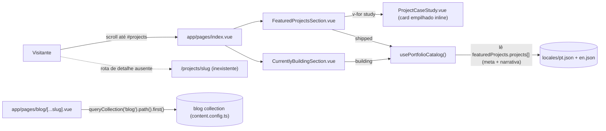
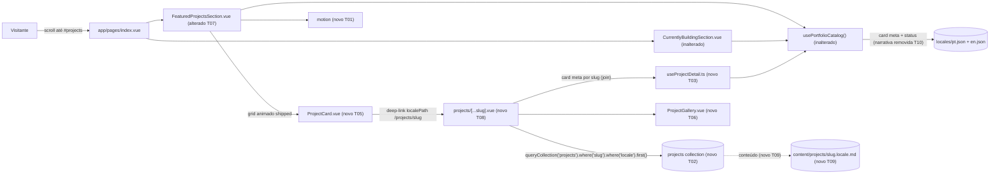

# Implementation Plan

## Request Summary
- Objective: Redesign Featured Projects into an animated creative card grid whose cards deep-link
  to a new SSR locale-aware `/projects/[slug]` detail route. Adopt a HYBRID data model: card
  metadata stays in the i18n `featuredProjects.projects[]` catalog (read by the unchanged synchronous
  `usePortfolioCatalog()`), while only the six narrative blocks + photo gallery move into a new
  `@nuxt/content` `projects` collection. The detail page JOINS the two sources by slug.
- Scope:
  - In: animated `ProjectCard` grid replacing the stacked `ProjectCaseStudy` inline render; new
    `ProjectGallery`; new `content.config.ts` `projects` collection (narrative frontmatter + gallery
    only); new `app/pages/projects/[...slug].vue` SSR detail route (join + 404 + per-block `v-if` +
    empty-safe gallery); migration of the six narrative blocks + gallery for the 3 existing shipped
    projects into per-locale collection files (`slug === id`); gallery authoring; new `motion`
    dependency with reduced-motion degradation; PT + EN copy with locale parity; Vitest coverage.
  - Out: blog changes; Currently Building redesign; server API endpoints; CMS/admin; image pipeline;
    adding NEW project entries; project OG image; other landing-section redesigns.
- Tier: standard
- Architecture references: `AGENTS.md` (§2/§3 — no hardcoded UI copy, i18n catalogs, no semicolons /
  single quotes / printWidth 100, `eslint .`, tests under `tests/unit/` glob `tests/**/*.test.ts`),
  `docs/agents/architecture.md` ("Layer responsibilities" — `app/components/sections/*` own
  presentation only, NOT routing/content strings; `app/pages/*` own route entry + SEO/Schema.org),
  `docs/agents/domain_rules.md` ("Locale parity rule", "Default locale + URL strategy" —
  `prefix_except_default`, PT at root / EN under `/en`). Note: architecture.md/domain_rules.md
  component inventory is stale (predates Featured Projects/blog); their enforced rules still apply.

## AS IS — Componentes impactados

Legenda: hoje os projetos `shipped` são renderizados como cards de estudo de caso empilhados
(`ProjectCaseStudy.vue`) dentro da landing única, sem grid e sem rota de detalhe. Todo o conteúdo
(meta + narrativa) vive no catálogo i18n `featuredProjects.projects[]`, lido por
`usePortfolioCatalog()`. O slice de blog já estabelece o padrão collection + rota SSR locale-aware
que este trabalho espelha (divergindo apenas na resolução por `slug`+`locale`).

## TO BE — Componentes propostos

Legenda: `ProjectCard.vue` (T05) monta o grid animado com `motion` (T01) e faz deep-link para a rota
SSR `projects/[...slug].vue` (T08). A rota faz JOIN: metadados de card vêm de `usePortfolioCatalog()`
por slug via os helpers puros de `useProjectDetail.ts` (T03), e narrativa + `ProjectGallery.vue` (T06)
vêm da collection `projects` (T02) resolvida por `slug`+`locale`, cujos arquivos são autorados na
migração (T09). `FeaturedProjectsSection.vue` (T07) troca o render empilhado pelo grid. As chaves i18n
do detalhe/card (T04) e a remoção da narrativa do i18n (T10) fecham o modelo HYBRID; a suíte
`useProjectDetail` (T11) cobre join/narrativa/gallery/validação. `usePortfolioCatalog()` permanece um
`computed` síncrono inalterado (CT-03).

## Tasks

### T01 — Add `motion` dependency
- **Files**: `package.json` (+ `yarn.lock` via install)
- **Change**: Add `motion` (motion.dev, Vue 3-compatible) to `dependencies`; run `yarn install` so
  the lockfile and `node_modules` resolve. No `nuxt.config.ts` change required (imported directly in
  the card component). Verify `nuxt prepare`/typecheck still passes.
- **Covers**: RF-09
- **Tests**: none directly (asserted indirectly via T05/`package.json` presence in RF-09 AC)
- **Risk**: Low — additive dependency.
- **Dependencies**: none

### T02 — Declare the `projects` content collection
- **Files**: `content.config.ts`
- **Change**: Add a `projects` collection alongside `blog`: `type: 'page'`, `source:
  'projects/*.md'`, schema `z.object({ slug: z.string(), locale: z.enum(['pt','en']),
  description: z.string().optional(), problem: z.string().optional(), solution: z.string().optional(),
  architecture: z.string().optional(), challenges: z.string().optional(), results: z.string().optional(),
  gallery: z.array(z.object({ src: z.string(), alt: z.string(), caption: z.string().optional() })).default([]) })`.
  `slug` + `locale` required (mirrors blog's required-field contract); narrative blocks optional
  (empty-safe); `gallery` defaults to `[]`. NO card-facing fields in this collection (CT-02).
- **Covers**: RF-06, CT-02
- **Tests**: `tests/unit/projectDetail.test.ts` (T11) asserts required/optional field contract via the
  pure validator in T03 that mirrors this schema.
- **Risk**: Low — additive collection, does not touch blog.
- **Dependencies**: none

### T03 — Pure detail helpers (`useProjectDetail.ts`)
- **Files**: `app/composables/useProjectDetail.ts` (new)
- **Change**: Export pure, node-testable helpers consumed by the detail page (kept free of Nuxt
  runtime so they unit-test like `usePortfolioCatalog`'s exported functions):
  - `NARRATIVE_BLOCK_KEYS = ['description','problem','solution','architecture','challenges','results']`
    (ordered per RF-03).
  - `selectNarrativeBlocks(doc)` → ordered `{ key, value }[]` of only the present/non-empty frontmatter
    blocks (empty-safe, per-block — RF-03).
  - `normalizeGallery(raw)` → `{ src, alt, caption? }[]`, dropping entries missing `src`/`alt`, empty
    input → `[]` (RF-04 / UI-04, `alt` required).
  - `findCaseStudyBySlug(catalog, slug)` → the `CaseStudy` whose `id === slug` or `undefined` (join key;
    supports the 404 path when card meta is absent — RF-10).
  - `validateProjectFrontmatter(data)` → `{ valid, errors }` mirroring the T02 schema required fields
    (`slug`, `locale`), unsupported locale rejected (parallels `server/utils/blog.ts`).
  Import `CaseStudy` type from `~/types/portfolio`. This does NOT modify `usePortfolioCatalog()`
  (CT-03 preserved).
- **Covers**: RF-03, RF-04, RF-05, RF-10 (join/guard support)
- **Tests**: `tests/unit/projectDetail.test.ts` (T11)
- **Risk**: Low — new pure module, no side effects.
- **Dependencies**: none (mirrors T02 schema; author together)

### T04 — Add i18n keys for card grid + detail page
- **Files**: `locales/pt.json`, `locales/en.json`
- **Change**: Add a `projectDetail` namespace (both locales, structurally identical) with: the six
  narrative block labels (`description`, `problem`, `solution`, `architecture`, `challenges`,
  `results`), gallery heading, and back-link label; plus any new card-grid labels needed by
  `ProjectCard` (e.g. status label, "view details" aria). Reuse existing `featuredProjects.*` keys
  where suitable. Zero hardcoded strings in the new components resolve outside i18n. Preserve
  structural parity (enforced by `tests/unit/i18nKeys.test.ts`).
- **Covers**: UI-01, RNF-04
- **Tests**: `tests/unit/i18nKeys.test.ts` (existing) must stay green.
- **Risk**: Medium — `i18nKeys` `assertStructuralParity` requires the added subtree to be identical
  in both locale files (same keys, equal-length arrays).
- **Dependencies**: none

### T05 — `ProjectCard.vue` (animated grid card)
- **Files**: `app/components/sections/ProjectCard.vue` (new)
- **Change**: Presentational card (props: a `CaseStudy`) rendering title, thumbnail (`v-if
  study.image`), and one badge per `techStack` entry (RF-05). Wrap navigation in a `NuxtLink` to
  `useLocalePath()('/projects/' + study.id)` with the blog focus-visible pattern
  (`focus-visible:ring-2 ring-accent`) — keyboard-focusable, SSR-present (RF-02, UI-02). Apply
  `motion`-based entrance-on-viewport + hover animation (RF-09), gated so that under
  `prefers-reduced-motion: reduce` no transform/opacity motion applies and content renders in final
  visible state (UI-03, RNF-01) — use a reduced-motion guard and/or the existing `main.css`
  reduced-motion rules. All copy via `$t(...)` (UI-01). Sections own presentation only — routing
  target is a link, content strings come from i18n/props (architecture.md layer boundary).
- **Covers**: RF-01, RF-02, RF-05, RF-09, UI-01, UI-02, UI-03, RNF-01
- **Tests**: exercised via RF-01/RF-05 render AC; logic (localePath target, badge count) verified in
  code review + i18n parity.
- **Risk**: Medium — `motion` SSR/hydration correctness and reduced-motion gating.
- **Dependencies**: T01, T03, T04

### T06 — `ProjectGallery.vue` (empty-safe gallery)
- **Files**: `app/components/sections/ProjectGallery.vue` (new)
- **Change**: Presentational gallery (props: `{ src, alt, caption? }[]`). Render one element per image
  with a non-empty `alt`; render NO gallery container/heading when the array is empty (RF-04, UI-04).
  Gallery heading label via `$t('projectDetail.galleryHeading')` (no hardcoded copy). Lazy/async image
  loading consistent with `ProjectCaseStudy` image handling.
- **Covers**: RF-04, RF-05 (detail badges are on the page, gallery here), UI-04
- **Tests**: gallery normalization asserted in `tests/unit/projectDetail.test.ts` (T11).
- **Risk**: Low.
- **Dependencies**: T03, T04

### T07 — Rework `FeaturedProjectsSection.vue` into the card grid
- **Files**: `app/components/sections/FeaturedProjectsSection.vue`; delete
  `app/components/sections/ProjectCaseStudy.vue` (now unused)
- **Change**: Replace the `v-for` stacked `SectionsProjectCaseStudy` render with the animated
  `ProjectCard` grid over `shipped` from `usePortfolioCatalog()` (unchanged consumption). Keep
  `id="projects"` on the `<section>` (required by `tests/unit/sectionComposition.test.ts`). Keep the
  section-level intersection reveal or delegate entrance motion to `ProjectCard`/`motion`. Remove the
  now-dead `ProjectCaseStudy.vue` import and file (only referenced here — verified). Grid order follows
  the i18n array order (no `order` field).
- **Covers**: RF-01, RF-09
- **Tests**: `tests/unit/sectionComposition.test.ts` (existing) must stay green (section still present
  at `id="projects"`; `ProjectCard` is not a `*Section` component so it is not matched by the
  composition regex).
- **Risk**: Medium — deleting `ProjectCaseStudy.vue`; must confirm no other importer.
- **Dependencies**: T05

### T08 — `projects/[...slug].vue` SSR detail route
- **Files**: `app/pages/projects/[...slug].vue` (new)
- **Change**: Catch-all page mirroring `app/pages/blog/[...slug].vue`'s structure
  (`useAsyncData` + `queryCollection` + `createError` 404 + `useSeoMeta`/`useSchemaOrg`), but resolve
  with `queryCollection('projects').where('slug','=',slug).where('locale','=',locale).first()`
  (shared slug + active-locale filter — the deliberate deviation from blog's path resolution, CT-01).
  Derive `slug` from the (locale-prefix-stripped) route param. JOIN card meta from
  `usePortfolioCatalog()` via `findCaseStudyBySlug` (title/status/techStack badges/liveUrl/repoUrl —
  RF-05). Render the six narrative blocks with per-block `v-if` and their i18n labels (RF-03); render
  `ProjectGallery` (empty-safe, RF-04). `throw createError({ statusCode: 404, fatal: true })` when the
  collection doc is missing for the active locale (RF-10, RF-11). SSR-present content (RNF-02);
  per-page chunking gives code-split from landing (RNF-05). Add `useSeoMeta` + optional
  `CreativeWork` Schema.org node (analogous to blog `BlogPosting`). Page owns routing/SEO; presentation
  delegated to components (architecture.md layer boundary). Project OG image is OUT of scope.
- **Covers**: RF-02, RF-03, RF-06, RF-10, RF-11, RNF-02, RNF-05, CT-01
- **Tests**: 404/slug/locale logic covered via `findCaseStudyBySlug`/validator in T11; SSR presence is
  manual/AC.
- **Risk**: Medium — SSR 404 correctness and locale-filtered query; must not read narrative from i18n.
- **Dependencies**: T02, T03, T04, T06

### T09 — Author the `projects` collection content (migration)
- **Files**: `content/projects/eu-no-play.pt.md`, `content/projects/eu-no-play.en.md`,
  `content/projects/bolao-copa.pt.md`, `content/projects/bolao-copa.en.md`,
  `content/projects/csv-view.pt.md`, `content/projects/csv-view.en.md` (all new)
- **Change**: One markdown file per project per locale (6 total). Frontmatter carries required
  `slug` (=== the project `id`) + `locale`, the project's non-empty narrative blocks copied 1:1 from
  the current `featuredProjects.projects[]` fields (`description`, `problem`, `solution`,
  `architecture`, `challenges`, `results`) for that locale, and an authored `gallery` array of
  `{ src, alt, caption? }` (author real image paths under `public/projects/...`; `alt` required; empty
  gallery is acceptable/empty-safe). Body optional. Mechanical 1:1 narrative copy — no new projects.
- **Covers**: RF-07
- **Tests**: `tests/unit/projectDetail.test.ts` (T11) asserts each shipped id has `.pt.md` + `.en.md`
  with valid `slug`/`locale` frontmatter.
- **Risk**: Medium — gallery image assets may not yet exist (see Open Questions); narrative must match
  the pre-removal i18n text verbatim for each locale.
- **Dependencies**: T02

### T10 — Remove migrated narrative from the i18n catalog
- **Files**: `locales/pt.json`, `locales/en.json`, `tests/unit/projectCatalog.test.ts`
- **Change**: Remove the six migrated narrative fields (`description`, `problem`, `solution`,
  `architecture`, `challenges`, `results`) from every `featuredProjects.projects[]` entry in BOTH
  locale files (identically, to preserve `i18nKeys` structural parity). KEEP all card-facing fields
  (`id`, `status`, `title`, `image`, `tags`, `techStack`, `liveUrl`, `repoUrl`). Update
  `tests/unit/projectCatalog.test.ts` — the "keeps filled case-study prose for shipped projects"
  assertions (csv-view `problem`/`solution`/`results` truthy) no longer hold from the i18n source;
  retarget them to the collection or drop them, keeping partition/dedup/parity assertions intact.
  `usePortfolioCatalog()` is NOT modified (CT-03) — its narrative fields simply resolve to `undefined`.
- **Covers**: RF-07, CT-03
- **Tests**: `tests/unit/projectCatalog.test.ts` (updated) + `tests/unit/i18nKeys.test.ts` stay green.
- **Risk**: Medium — parity test is strict on per-element key sets; removal must be symmetric across
  locales; existing catalog test asserts prose presence and will break if not updated.
- **Dependencies**: T09

### T11 — Vitest coverage for detail helpers + migration
- **Files**: `tests/unit/projectDetail.test.ts` (new)
- **Change**: Cover the pure helpers and migration invariants (node env, no DOM): `selectNarrativeBlocks`
  present→included / absent→excluded and order (RF-03); `normalizeGallery` alt-required, drops invalid
  entries, empty→`[]` (RF-04/UI-04); `findCaseStudyBySlug` returns meta for a known slug and `undefined`
  for an unknown slug (RF-10 guard); `validateProjectFrontmatter` requires `slug`+`locale` and rejects
  an unsupported locale (RF-06/RF-07); and a filesystem assertion that each shipped id
  (`eu-no-play`, `bolao-copa`, `csv-view`) has both `content/projects/<id>.pt.md` and `.en.md` with
  `slug === id` (RF-07). Ensure `eslint .`, `prettier --check .`, `nuxt typecheck`, `vitest run` all
  exit 0 (RNF-03).
- **Covers**: RNF-03 (and verifies RF-03, RF-04, RF-06, RF-07, RF-10)
- **Tests**: this task IS the tests.
- **Risk**: Low.
- **Dependencies**: T03, T09

## Execution Phases
| Phase | Tasks | Parallel-safe? |
|-------|-------|----------------|
| 1 — Foundations (deps, schema, helpers, i18n keys) | T01, T02, T03, T04 | Yes (distinct files) |
| 2 — Presentational components | T05, T06 | Yes (distinct files) |
| 3 — Integration (grid + SSR detail route) | T07, T08 | Yes (distinct files) |
| 4 — Content migration (author collection) | T09 | Single task |
| 5 — De-i18n narrative + test coverage | T10, T11 | Yes (distinct files) |

## Risks
| Risk | Blast radius | Mitigation | Rollback |
|------|-------------|------------|----------|
| `motion` SSR/hydration mismatch or reduced-motion leak | Featured Projects grid on landing | Gate animation behind reduced-motion guard + `import.meta.client`; ensure SSR renders final visible state; lean on existing `main.css` reduced-motion rules | Revert T05/T07; fall back to CSS-only reveal |
| Removing narrative from i18n breaks `projectCatalog.test` / `i18nKeys` parity | Test suite (RNF-03) | Remove identically in both locales; update `projectCatalog.test.ts` prose assertions in the same change; run `vitest run` | `git checkout` locale files + test |
| SSR detail 404 / locale-filtered query incorrect | `/projects/[slug]` route | Mirror blog `createError` 404 shape; explicit `.where('locale')` filter; verify PT/EN via manual request | Revert T08 |
| Gallery image assets missing → broken images | Detail page gallery | `alt` required + empty-safe render; author real assets under `public/projects/` or ship empty gallery | Empty `gallery: []` (no DOM node) |
| Dead `ProjectCaseStudy.vue` deletion has a hidden importer | Build/landing | Grep confirms sole importer is `FeaturedProjectsSection`; delete in same task | Restore file + import |

## Open Questions
- Gallery image sourcing: RF-07 puts gallery authoring in scope, but the actual image assets (paths
  under `public/projects/...`) for the three shipped projects are not confirmed to exist. Impact: T09
  may author `gallery: []` (empty-safe, no gallery DOM) if assets are unavailable, deferring real
  imagery. Non-blocking — the empty-safe path satisfies RF-04/UI-04. Confirm whether real gallery
  assets should be produced now or the gallery ships empty initially.
- Architecture note: `docs/agents/architecture.md` and `docs/agents/domain_rules.md` component
  inventories are stale (predate Featured Projects/blog). Their enforced RULES (layer boundaries,
  locale parity, URL strategy) are honored and named above; their component lists are not treated as
  authoritative. Plan is architecture-rule-validated, not inventory-validated.

## Assumptions
- `usePortfolioCatalog()` remains untouched (CT-03): after T10 its narrative fields simply resolve to
  `undefined`; the `{ catalog, shipped, building }` shape, dedup-by-`id`, and status partitioning are
  unchanged. The `CaseStudy` type's narrative optionals are left in place (harmless, now always
  `undefined`) rather than trimmed. [UNVERIFIED as to whether a follow-up type cleanup is desired.]
- `ProjectCaseStudy.vue` is imported ONLY by `FeaturedProjectsSection.vue` (grep-consistent) and is
  safe to delete in T07.
- No contract artifacts are emitted: the SPEC `### Contracts` block describes content-collection schema
  shapes and a Nuxt page route, not an HTTP/gRPC/AsyncAPI surface — the repo has no server API contract
  (`docs/agents/api_contracts.md` records the absence). Contract emission is intentionally skipped.
- `motion` (motion.dev) is Vue 3 / Nuxt 4 SSR-compatible and installable via `yarn`; it is verified
  absent from `package.json`.
- The three shipped project ids are `eu-no-play`, `bolao-copa`, `csv-view` (verified in
  `projectCatalog.test.ts` and both locale catalogs); `slug === id` reuse applies to each.
