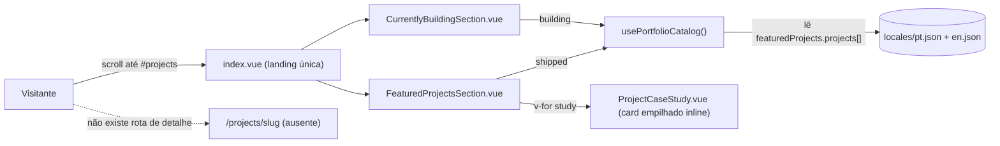
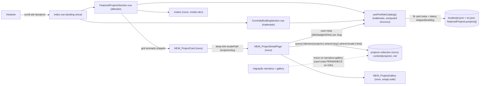

# SPEC: projects-showcase-redesign

## Metadata
- Source: developer description via /plan
- Service: werlesson-cv (Nuxt 4 SSR portfolio, single repo)
- Tier: standard
- Version: 1.2
- Changelog: v1.2 — reconciliation pass (v2 answers): REVERSED two v1.1 decisions after
  deeper code analysis. M-03 is now HYBRID (card metadata STAYS in i18n
  `featuredProjects.projects[]`; `usePortfolioCatalog()` remains a synchronous reactive
  computed with unchanged `{catalog,shipped,building}` shape + dedup-by-id/RF-08 in the
  composable; ONLY narrative + gallery move to the `projects` collection). M-02 is now
  FRONTMATTER FIELDS (six narrative blocks are optional frontmatter strings rendered
  per-block with `v-if`, not prose in the markdown body). Also: slug=id reuse, i18n array
  ordering (no `order` field), gallery authoring in scope, locale-filtered query stated as
  a deliberate deviation from blog's path-only resolution, project OG image out of scope.
  v1.1 — clarification pass resolved M-01..M-05 (gallery shape, collection schema, migration,
  per-locale authoring, route literal). Zero remaining `[NEEDS CLARIFICATION]` markers.
- Architecture references: `AGENTS.md`, `docs/agents/architecture.md`, `docs/agents/domain_rules.md`

## Context

The Featured Projects section (`app/components/sections/FeaturedProjectsSection.vue`)
currently renders every `status: 'shipped'` project as a full, stacked case-study
card (`app/components/sections/ProjectCaseStudy.vue`) inline on the single landing
route (`app/pages/index.vue`). There is no grid and no dedicated detail page. Project
data lives entirely in the i18n locale catalogs under `featuredProjects.projects[]`
(`locales/pt.json` + `locales/en.json`) and is read through `usePortfolioCatalog()`
(`app/composables/usePortfolioCatalog.ts`), which normalizes, de-duplicates by `id`,
and partitions the catalog into `shipped` (Featured Projects) and `building`
(`app/components/sections/CurrentlyBuildingSection.vue`). De-duplication by `id` in
that composable is the single source of the mutual-exclusion guarantee: an `id`
appears in exactly one partition.

The blog slice establishes the target pattern for the collection + locale-aware SSR
detail route, but this feature deliberately DEVIATES from it in slug/locale resolution.
Blog is a `@nuxt/content` collection (`blog`, schema at `content.config.ts:9`) plus a
locale-aware SSR detail route (`app/pages/blog/[...slug].vue`) that resolves by PATH with
`queryCollection('blog').path(...).where('draft','=',false).first()` and throws
`createError({ statusCode: 404 })` on miss; blog gives each locale a DISTINCT slug and
never filters by `locale`. The `projects` collection instead SHARES one `slug` across
locales and resolves by `.where('slug','=',slug).where('locale','=',locale).first()`
(slug + active-locale filter). This is an intentional divergence, not blog parity — the
feature mirrors blog's collection/SSR/404 shape while diverging on resolution (see
CT-01/CT-02/M-04). Both author one markdown file per locale via a required `locale`
frontmatter field, and the i18n `prefix_except_default` strategy strips the locale prefix
from route params.

This feature redesigns Featured Projects into an animated creative card grid whose
cards deep-link to a new SSR `/projects/[slug]` detail route. The data model is HYBRID:
card-facing metadata (`id`/`slug`, `status`, `title`, `image` thumbnail, `tags`,
`techStack`, `liveUrl`, `repoUrl`) STAYS in the i18n `featuredProjects.projects[]` catalog
and is still read through `usePortfolioCatalog()` — a synchronous reactive `computed` whose
`{ catalog, shipped, building }` shape, de-dup-by-`id`, and status partitioning are
unchanged. Only the long-form NARRATIVE (six optional frontmatter blocks) and the photo
`gallery` move into a NEW `@nuxt/content` `projects` collection, keyed by a `slug` shared
across locales (`slug === id`). The detail page JOINS the two: card meta from
`usePortfolioCatalog` (title/badges/techStack/links) + narrative/gallery from the
collection. The feature also adds motion-based animation via a new `motion` dependency
(motion.dev, verified absent from `package.json`) that degrades under
`prefers-reduced-motion`.

Note: `docs/agents/architecture.md` and `docs/agents/domain_rules.md` predate the
Featured Projects, Currently Building, and blog slices (they still describe
`ProjectSection.vue` "Eu no Play" as the only project surface); their enforced rules
below still apply, but their component inventory is stale.

Rules honored from the architecture references:
- All UI copy lives in `locales/{pt,en}.json`; zero hardcoded text
  (`AGENTS.md` §2 / §3 "Never add hardcoded UI text").
- Locale parity: `en.json` and `pt.json` must share the same top-level key set and
  required nested keys, enforced by `tests/unit/i18nKeys.test.ts`
  (`docs/agents/domain_rules.md` "Locale parity rule").
- Routing: PT at root, EN under `/en`; `strategy: prefix_except_default`
  (`docs/agents/domain_rules.md` "Default locale + URL strategy").
- Layer boundaries: `app/components/sections/*` own presentation only, NOT routing or
  content strings; pages own route entry and SEO
  (`docs/agents/architecture.md` "Layer responsibilities").
- Format/lint: no semicolons, single quotes, printWidth 100; never commit code that
  fails `eslint .` (`AGENTS.md` §2 / §3).
- Tests colocated under `tests/unit/`, glob `tests/**/*.test.ts` (`AGENTS.md` §2).

## AS IS — Estado atual

Legenda: hoje os projetos shipped são renderizados como cards de estudo de caso
empilhados dentro da landing única, sem grid e sem página de detalhe. Todo o conteúdo
vem do catálogo i18n `featuredProjects.projects[]` via `usePortfolioCatalog()`, que
também alimenta a seção Currently Building e garante exclusão mútua por `id`.

## TO BE — Estado proposto

Legenda: `NEW_ProjectCard` (RF-01, UI-01, UI-02) monta o grid animado com `motion`
(RF-09, RNF-01) e faz deep-link para `NEW_ProjectDetailPage` (RF-02, CT-01), uma rota
SSR locale-aware que faz JOIN: metadados de card (title/badges/techStack/links) vêm de
`usePortfolioCatalog()` por slug, e narrativa + `NEW_ProjectGallery` vêm da nova collection
`projects` filtrada por `slug` + `locale` (RF-06, CT-02), renderizadas de forma empty-safe
(RF-03 por-bloco via `v-if`, RF-04). A migração move APENAS os seis blocos de narrativa e a
`gallery` para a collection; os metadados de card PERMANECEM em `featuredProjects.projects[]`.
`usePortfolioCatalog()` (RF-08, CT-03) continua um `computed` síncrono e reativo sobre as
mensagens i18n, preservando a forma pública `{ catalog, shipped, building }`, a de-dup por
`id` e a exclusão mútua por status — tudo garantido DENTRO do composable, exatamente como
hoje. Não há projetos `building` atualmente, então RF-08 é presentemente vacuosa mas a
garantia estrutural permanece.

## Scope
- **In**: Featured Projects redesign into an animated creative card grid; new SSR
  locale-aware `/projects/[slug]` detail route; new `@nuxt/content` `projects`
  collection + schema (narrative frontmatter blocks + gallery only); migration of the
  six narrative blocks + gallery out of `featuredProjects.projects[]` into the collection
  (card metadata STAYS in i18n); authoring gallery images/frontmatter for the migrated
  projects; photo gallery on detail (empty-safe); tech badges on card + detail; `motion`
  dependency with reduced-motion degradation; PT-BR + EN-US copy; Vitest coverage for
  catalog/slug/collection logic.
- **Out**: Blog collection/route changes; Currently Building redesign; new server API
  endpoints; CMS/admin authoring UI; image optimization pipeline changes; adding NEW
  project entries (only existing projects are migrated; authoring galleries for them is
  in scope); OG image for `/projects/[slug]` (project OG parity deferred); redesign of
  other landing sections.

## RIGID (Non-Negotiable)

### Functional Requirements

- RF-01 [Event-Driven]: When the Featured Projects section enters the viewport, the
  system SHALL render every project whose status is `shipped` as an item in a creative
  animated card layout, each card showing title, thumbnail, and tech-stack badges.
  - AC: For N shipped projects, exactly N cards render, each with a non-empty title,
    a thumbnail element when an image path exists, and one badge per tech-stack entry.

- RF-02 [Event-Driven]: When a user activates a project card (click or Enter/Space on
  its focusable link), the system SHALL navigate to the project's SSR detail page at a
  locale-aware `/projects/[slug]` route (EN served under `/en/projects/[slug]`).
  - AC: Each card exposes a `NuxtLink` whose resolved target equals
    `useLocalePath()('/projects/<slug>')`; the target renders on the server (present in
    initial HTML, not client-only).

- RF-03 [State-Driven]: While a project detail page is rendered, the system SHALL
  display the project's six narrative blocks (description, problem, solution, architecture,
  challenges, results) — each authored as an OPTIONAL frontmatter string field on the
  `projects` collection document — as individually labeled sections, and SHALL omit any
  block whose frontmatter value is absent/empty by guarding each with its own `v-if`.
  - AC: A project with all six frontmatter blocks renders six labeled sections; a project
    with any subset renders exactly the present blocks and emits no empty/placeholder
    section; each block is independently testable (present block → its section; absent
    block → no section).

- RF-04 [State-Driven]: While a project detail page is rendered, the system SHALL
  display a photo gallery of the project's images when at least one image exists, and
  SHALL render no gallery container when none exist.
  - AC: A project with ≥1 gallery image renders a gallery with one element per image;
    a project with zero images produces no gallery DOM node.

- RF-05 [Ubiquitous]: The system SHALL render each project's tech stack as badge
  elements on both the card and the detail page.
  - AC: For a project with T tech entries, T badge elements render on the card and T
    on the detail page; a project with zero tech entries renders no badge container in
    either location.

- RF-06 [Ubiquitous]: The system SHALL source project long-form content and galleries
  from a new `@nuxt/content` collection named `projects`, defined in `content.config.ts`
  with source `content/projects/*.md`, mirroring the `blog` collection pattern
  (`content.config.ts:9`, verified).
  - AC: `content.config.ts` declares a `projects` collection; the detail route resolves
    content via `queryCollection('projects')`; no project narrative is read from
    `featuredProjects.projects[]` on the detail page.

- RF-07 [Ubiquitous]: The system SHALL migrate ONLY the long-form NARRATIVE (the six
  optional blocks: description, problem, solution, architecture, challenges, results) and
  the photo `gallery` for every existing project out of the i18n `featuredProjects.projects[]`
  catalog (`locales/pt.json` + `locales/en.json`, verified at `usePortfolioCatalog.ts:120`)
  into the `projects` collection, one markdown file per project per locale
  (`content/projects/<slug>.pt.md` + `content/projects/<slug>.en.md`, per M-04), keyed by a
  `slug` shared across locales where `slug === id` (the project's existing `id` reused
  verbatim). Narrative migration is a mechanical 1:1 copy of the existing discrete i18n
  string fields into frontmatter string fields. Card-facing metadata (`id`/`slug`, `status`,
  `title`, `image`, `tags`, `techStack`, `liveUrl`, `repoUrl`) is NOT migrated: it REMAINS in
  `featuredProjects.projects[]` and is still read by `usePortfolioCatalog()`. The i18n catalog
  is NOT removed. The two sources are joined by slug on the detail page.
  - AC: For each existing project id, a corresponding collection document exists per locale
    (`.pt.md` + `.en.md`) with `slug === id` and carrying the project's non-empty narrative
    blocks and gallery in frontmatter; card metadata still resolves from
    `featuredProjects.projects[]` (present in both locale files, not removed); no project is
    dropped from its grid after migration.

- RF-08 [Ubiquitous]: The system SHALL keep the card grid partitioned by status
  (`shipped` on Featured Projects, `building` on Currently Building) and SHALL guarantee
  each project id appears in exactly one partition. Mutual exclusion continues to be
  enforced INSIDE `usePortfolioCatalog()` exactly as today: the composable de-duplicates
  the i18n `featuredProjects.projects[]` catalog by `id` and partitions by `status`,
  yielding disjoint `shipped`/`building` sets by construction. (There are currently 0
  `building` projects, so this is presently vacuous, but the structural guarantee holds.)
  - AC: No project id renders in both the Featured Projects grid and the Currently
    Building grid; a Vitest test asserts the composable's two partitions are disjoint by id
    and that each id maps to a single `status`.

- RF-09 [Event-Driven]: When the Featured Projects grid enters the viewport and on
  card hover, the system SHALL apply `motion`-based entrance and hover animation (new
  `motion` dependency, verified absent from `package.json`).
  - AC: With animation active, cards transition from a hidden to a visible state on
    first viewport entry and respond to hover; the `motion` package is declared in
    `package.json` dependencies.

- RF-10 [Unwanted]: If a request targets `/projects/[slug]` for a slug that has no
  matching document in the `projects` collection for the active locale, then the system
  SHALL respond with HTTP 404 (mirroring `app/pages/blog/[...slug].vue:55`, verified).
  - AC: A request to a non-existent project slug returns status 404 and the custom
    error page, not a blank or partially rendered detail page.

- RF-11 [State-Driven]: While serving a project detail page, the system SHALL render
  the content document matching the active locale (PT at root, EN under `/en`).
  - AC: Requesting `/projects/<slug>` returns PT content; `/en/projects/<slug>`
    returns EN content for the same project.

### UI Requirements

- UI-01 [Ubiquitous]: Each project card SHALL present the title, a thumbnail (when an
  image exists), and tech-stack badges, with copy resolved via i18n keys.
  - AC: No literal UI string is hardcoded in the card component; all labels resolve
    through `$t(...)`; badge and title text come from project data.

- UI-02 [Ubiquitous]: Each project card's navigation target SHALL be keyboard-focusable
  and expose a visible focus indicator consistent with the blog focus-visible pattern
  (`app/pages/blog/[...slug].vue`, `focus-visible:ring-2 ring-accent`).
  - AC: Tabbing reaches each card link; the focused link shows a visible focus ring;
    Enter activates navigation.

- UI-03 [Unwanted]: If the user agent reports `prefers-reduced-motion: reduce`, then
  card entrance and hover animations SHALL NOT apply transform/opacity motion; content
  SHALL render in its final visible state.
  - AC: Under a `prefers-reduced-motion: reduce` context, cards are fully visible on
    load with no entrance transition and no hover transform.

- UI-04 [State-Driven]: While the detail page renders, the gallery SHALL present
  images in a layout that omits empty containers when no images exist (RF-04).
  - AC: Zero-image projects show no gallery heading or grid; multi-image projects show
    each image with a non-empty `alt` derived from project/gallery data.

### Contracts

- CT-01: Route `GET /projects/[slug]` (and `GET /en/projects/[slug]`) → SSR-rendered
  HTML joining i18n card meta (by slug) with the matching `projects` collection document;
  404 when unmatched. New file `app/pages/projects/[...slug].vue` using the catch-all
  `[...slug].vue` and literal segment `projects` → route `/projects/<slug>` (locale-aware
  via `useLocalePath`). DEVIATION from blog: whereas `blog` resolves by PATH with a distinct
  slug per locale, the projects page resolves with
  `queryCollection('projects').where('slug','=',slug).where('locale','=',locale).first()`
  — a shared slug across locales plus an explicit active-locale filter. Same collection/SSR/404
  shape as blog, different resolution.

- CT-02: `projects` content collection in `content.config.ts`, source
  `content/projects/*.md`, `type: 'page'`. The collection holds ONLY narrative + gallery;
  card-facing fields (`status`, `title`, `image`, `tags`, `techStack`, `liveUrl`, `repoUrl`)
  are NOT in the collection — they stay in the i18n `featuredProjects.projects[]` catalog and
  are read via `usePortfolioCatalog()`. Final frontmatter field list:
  - Frontmatter (required): `slug: z.string()` (equals the project's `id`, shared across
    locales), `locale: z.enum(['pt','en'])`.
  - Frontmatter (optional/empty-safe narrative blocks, each a string rendered per-block with
    `v-if` per RF-03): `description: z.string().optional()`, `problem: z.string().optional()`,
    `solution: z.string().optional()`, `architecture: z.string().optional()`,
    `challenges: z.string().optional()`, `results: z.string().optional()`.
  - Frontmatter (optional gallery, per M-01): `gallery: z.array(z.object({ src: z.string(),
    alt: z.string(), caption: z.string().optional() })).default([])` (`alt` required to satisfy
    UI-04, `caption` optional, empty/absent array renders no gallery block).
  - Markdown body: optional/free-form (unused, or a short overview). Narrative is authored in
    frontmatter fields, NOT in the body — so no `ContentRenderer`-driven narrative is required
    (an optional body may still be rendered if authored).
  - Detail page reads `title`/badges/`techStack`/links from i18n by slug; narrative + gallery
    from this collection.

- CT-03: `usePortfolioCatalog()` public surface `{ catalog, shipped, building }`
  (verified `app/composables/usePortfolioCatalog.ts:149`) SHALL remain the read/partition API
  consumed by both sections, UNCHANGED. It stays a synchronous, reactive `computed` over the
  i18n `featuredProjects.projects[]` messages (NOT async, NOT reading from the collection);
  its returned shape, de-dup-by-`id`, and mutual-exclusion-by-`id`/`status` guarantee (RF-08)
  are all preserved and stay enforced inside the composable exactly as today. The composable's
  data source is NOT changed by this feature.

### Non-Functional Requirements

- RNF-01: Under `prefers-reduced-motion: reduce`, the Featured Projects grid SHALL
  execute zero transform/opacity animation frames (0 motion) and present content in
  final state (there is existing reduced-motion precedent in
  `app/assets/css/main.css`, grep-verified).
  - AC: An automated/manual check under reduced-motion shows no animated style is
    applied to cards.

- RNF-02: The project detail page SHALL be server-rendered (`ssr: true`,
  `nuxt.config.ts`), with project content present in the initial HTML payload.
  - AC: The detail page's title and first narrative block appear in the server response
    body before client hydration.

- RNF-03: The change SHALL pass all quality gates: `eslint .`, `prettier --check .`,
  `nuxt typecheck`, and `vitest run` (Vitest unit tests covering catalog partitioning,
  slug resolution, and collection normalization logic under `tests/unit/`).
  - AC: All four commands exit with status 0 on the finished change; new tests exist
    for catalog/slug/collection logic.

- RNF-04: All user-facing copy SHALL come from `locales/pt.json` + `locales/en.json`
  with zero hardcoded UI text, and the two locale files SHALL keep structural parity
  (enforced by `tests/unit/i18nKeys.test.ts`).
  - AC: `i18nKeys.test.ts` passes with the new keys present in both locales; no literal
    UI copy exists in the new/changed components.

- RNF-05: The `/projects/[slug]` detail route SHALL be code-split from the landing
  bundle via Nuxt per-page chunking (as the blog route already is).
  - AC: The detail route's component code is not included in the landing (`index`)
    entry chunk.

## FLEXIBLE (Implementation Suggestions)

- Creative layout form (masonry vs 3D-tilt vs carousel) is an implementation choice;
  any option satisfying RF-01/RF-09/UI-03 is acceptable. Suggest starting with a
  responsive masonry/grid + `motion` hover tilt to keep SSR/hydration simple.
- Extract a new presentational `ProjectCard.vue` under `app/components/sections/` and a
  new `ProjectGallery.vue`; keep routing/content-fetching in the page component per the
  `docs/agents/architecture.md` layer boundary (sections own presentation only).
- Detail page `app/pages/projects/[...slug].vue` can mirror
  `app/pages/blog/[...slug].vue`'s structure (useAsyncData + `queryCollection` +
  `createError` 404 + `useSeoMeta`/`useSchemaOrg`), but resolve with
  `.where('slug','=',slug).where('locale','=',locale).first()` (not blog's path resolution),
  join card meta from `usePortfolioCatalog()` by slug, and render the six frontmatter
  narrative blocks per-block with `v-if` plus the gallery (empty-safe).
- Reduced-motion: gate `motion` animations behind a `useReducedMotion`-style check or a
  media-query guard, and/or lean on the existing `main.css` reduced-motion rules.
- Consider a `defineArticle`/`CreativeWork` Schema.org node on the detail page,
  analogous to the blog `BlogPosting` node.
- Wire the migration as a one-off content authoring step: write `content/projects/<slug>.<locale>.md`
  per locale carrying only the six narrative frontmatter blocks + `gallery` (+ required
  `slug`/`locale`). Do NOT remove or alter `featuredProjects.projects[]` — card metadata and
  `status` stay in i18n and keep feeding `usePortfolioCatalog()` unchanged (M-03 HYBRID).
  Reuse each project's `id` as its `slug`; grid order follows the i18n array order (no `order`
  field). The detail page joins i18n card meta (by slug) with the collection narrative/gallery.

## Acceptance Criteria Summary

| ID     | Criterion                                                                  | Testable? |
| ------ | -------------------------------------------------------------------------- | --------- |
| RF-01  | N shipped projects → N animated cards with title/thumb/badges              | Yes       |
| RF-02  | Card link target = localePath('/projects/<slug>'), SSR-present             | Yes       |
| RF-03  | Detail renders non-empty narrative blocks only, empty-safe                 | Yes       |
| RF-04  | Gallery present iff ≥1 image; no DOM node when zero                        | Yes       |
| RF-05  | T tech entries → T badges on card and detail                              | Yes       |
| RF-06  | Content read from `projects` collection via queryCollection               | Yes       |
| RF-07  | Narrative+gallery migrated per locale (slug=id); i18n card meta kept        | Yes       |
| RF-08  | Composable partitions shipped/building disjoint by id (i18n source)         | Yes       |
| RF-09  | motion entrance/hover active; `motion` in package.json                     | Yes       |
| RF-10  | Unknown project slug → HTTP 404                                            | Yes       |
| RF-11  | PT at root / EN under /en return correct locale content                    | Yes       |
| UI-01  | Card copy via $t, no hardcoded strings                                      | Yes       |
| UI-02  | Card link keyboard-focusable with visible focus ring                       | Yes       |
| UI-03  | reduced-motion → no entrance/hover transform                              | Yes       |
| UI-04  | Zero-image → no gallery; images carry non-empty alt                       | Yes       |
| RNF-01 | reduced-motion → 0 animation frames on cards                              | Yes       |
| RNF-02 | Detail title + first block in server HTML                                   | Yes       |
| RNF-03 | eslint / prettier / typecheck / vitest exit 0                               | Yes       |
| RNF-04 | i18nKeys parity passes; no hardcoded UI copy                                | Yes       |
| RNF-05 | Detail route code-split from landing bundle                                 | Yes       |

## Open Questions ([NEEDS CLARIFICATION])

None. All five markers (M-01..M-05) were resolved via `.handoff/clarifier-answers.md`.
M-02 and M-03 were REVERSED in the v1.2 reconciliation pass (v2 answers supersede v1):

- M-01 — RESOLVED: `gallery` is an array of objects
  `{ src: string, alt: string, caption?: string }`; `alt` required (UI-04), `caption`
  optional, empty/absent renders no gallery block. See CT-02.
- M-02 — RESOLVED (v1.2 correction): the six narrative blocks (description, problem,
  solution, architecture, challenges, results) are OPTIONAL FRONTMATTER string fields
  (`z.string().optional()`), rendered per-block with `v-if` (RF-03 per-block testable).
  They are NOT prose in the markdown body (reverses v1.1). The body is optional/free-form.
  See CT-02, RF-03.
- M-03 — RESOLVED (v1.2 correction): HYBRID model (reverses v1.1 "all to collection").
  Card metadata (`id`/`slug`, `status`, `title`, `image`, `tags`, `techStack`, `liveUrl`,
  `repoUrl`) STAYS in i18n `featuredProjects.projects[]`; `usePortfolioCatalog()` remains a
  synchronous reactive `computed` over i18n with unchanged `{catalog,shipped,building}`
  shape, dedup-by-id, and RF-08 enforced in the composable. ONLY narrative + gallery move
  to the collection; the i18n catalog is NOT removed. See RF-07, RF-08, CT-02, CT-03.
- M-04 — RESOLVED: one markdown file per project per locale
  (`content/projects/<slug>.pt.md` + `.en.md`), `slug` shared across locales (`slug === id`),
  resolved by `.where('slug').where('locale').first()`. This is a deliberate DEVIATION from
  blog's path-only, distinct-slug-per-locale resolution. See RF-07, CT-01, CT-02.
- M-05 — RESOLVED: page file `app/pages/projects/[...slug].vue` (catch-all), literal
  segment `projects` → `/projects/<slug>`, locale-aware via `useLocalePath`. See CT-01.
- Additional (v1.2): `slug === id` reuse; grid order = i18n array order (no `order` field);
  gallery authoring for migrated projects IN scope (new projects OUT); project OG image OUT
  of scope.
